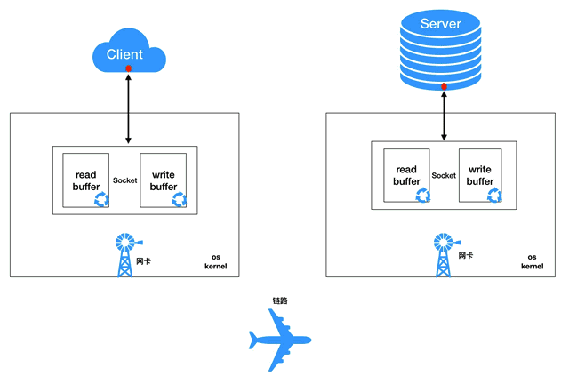

# 同步与异步，重点在于消息通知的方式;阻塞与非阻塞，重点在于等消息时候的行为。

1. 同步阻塞：小明在柜台干等着拿奶茶；
2. 同步非阻塞：小明在柜台边刷微博边等着拿奶茶；
3. 异步阻塞：小明拿着小票啥都不干，一直等着店员通知他拿奶茶；
4. 异步非阻塞：小明拿着小票，刷着微博，等着店员通知他拿奶茶。

[网络编程中Reactor与Proactor的概念及区别](http://www.111cn.net/sys/nginx/90325.htm)

[Netty系列之Netty高性能之道](http://www.infoq.com/cn/articles/netty-high-performance#theCommentsSection)