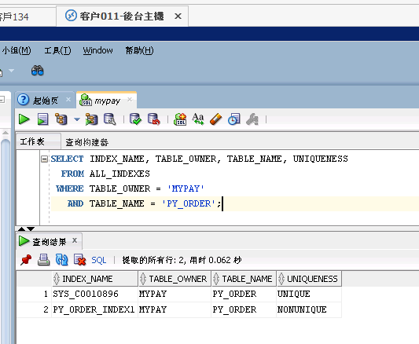

# Oracle 高水位説明和釋放表空間，加快表的查詢速度

## 高水位説明和釋放表空間，参考网站
https://docs.oracle.com/cd/E11882_01/server.112/e40540/logical.htm#CNCPT402
http://m.blog.itpub.net/26736162/viewspace-2139546/
https://blog.csdn.net/jaune161/article/details/38849243
https://www.linuxidc.com/Linux/2013-05/84875.htm
https://hk.saowen.com/a/f891aacc47803fe199cc226ce048c3785894db9fe850455ff7c22b0a5d516af5

## 执行命令
ALTER TABLE MYPAY.PY_ORDER ENABLE ROW MOVEMENT;
drop index MYPAY.PY_ORDER_INDEX1;
drop index MYPAY.PY_ORDER_INDEX3;
alter table MYPAY.PY_ORDER shrink space ;
alter table MYPAY.PY_ORDER disable row movement;
ALTER INDEX "MYPAY"."SYS_C0010896" REBUILD;

CREATE INDEX "MYPAY"."PY_ORDER_INDEX1" ON "MYPAY"."PY_ORDER" ("CREATE_DATE" DESC) 
PCTFREE 10 INITRANS 2 MAXTRANS 255 COMPUTE STATISTICS 
STORAGE(INITIAL 65536 NEXT 1048576 MINEXTENTS 1 MAXEXTENTS 2147483645
PCTINCREASE 0 FREELISTS 1 FREELIST GROUPS 1 BUFFER_POOL DEFAULT FLASH_CACHE DEFAULT CELL_FLASH_CACHE DEFAULT)
TABLESPACE "ts_myPay" ;

CREATE INDEX "MYPAY"."PY_ORDER_INDEX3" ON "MYPAY"."PY_ORDER" ("ORDER_NO" DESC) 
PCTFREE 10 INITRANS 2 MAXTRANS 255 COMPUTE STATISTICS 
STORAGE(INITIAL 65536 NEXT 1048576 MINEXTENTS 1 MAXEXTENTS 2147483645
PCTINCREASE 0 FREELISTS 1 FREELIST GROUPS 1 BUFFER_POOL DEFAULT FLASH_CACHE DEFAULT CELL_FLASH_CACHE DEFAULT)
TABLESPACE "ts_myPay" ;

## 测试命令

SELECT NVL(SUM(t.RED_ENVELOPES_OFFER), 0) FROM (select * from MYPAY.PY_ORDER where 1=1  and ORDER_NO like '%201805310090002016%' ) t WHERE 1=1 ;
SELECT NVL(SUM(t.RECHARGE_AMOUNT), 0) FROM (select * from MYPAY.PY_ORDER where 1=1  and ORDER_NO like '%201805310090002016%' ) t WHERE t.STATUS IN (2, 3, 4);
SELECT NVL(SUM(t.RECHARGE_AMOUNT), 0) FROM (select * from MYPAY.PY_ORDER where 1=1  and ORDER_NO like '%201805310090002016%' ) t WHERE t.STATUS = 0;
SELECT *FROM ( SELECT A.*, ROWNUM RN FROM ( select * from MYPAY.PY_ORDER where 1=1  and ORDER_NO like '%201805310090002016%'  order by CREATE_DATE  desc ) A WHERE ROWNUM <= 30 ) WHERE RN >= 1;

