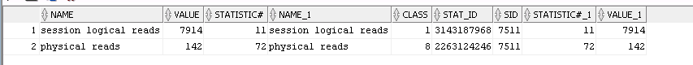

# windows 2008 disk IO 过大问题


back-134-test
VN_@vb@F07gd%mV
35.234.4.90
10.140.1.68
myPay
DB 密码 eje93nf

sqlplus myPay/eje93nf@mypay


---


```

column NAME format a30
column GB format a40
column CLASS format a10
column STAT_ID format a10
column STATISTIC format a10

set pagesize 25
set linesize 300


SELECT S.NAME,
       TO_CHAR(ST.VALUE / 1024 / 1024 / 1024) "GB",
       TO_CHAR(S.CLASS) "CLASS",
       TO_CHAR(S.STAT_ID) "STAT_ID",
       TO_CHAR(ST.STATISTIC#) "STATISTIC"
  FROM V$STATNAME S, V$SYSSTAT ST
 WHERE ST.STATISTIC# = S.STATISTIC#
   AND S.NAME IN ('session logical reads', 'physical reads')
 ORDER BY ST.VALUE DESC;


-- session logical reads(内存占用)
705555 * 8 / 1024 / 1024 = 5.3G

```




```

column OWNER format a10
column SEGMENT_NAME format a30
column SEGMENT_TYPE format a20
column BKS format a10
column MB format a10

set pagesize 25
set linesize 300

SELECT OWNER,
       SEGMENT_NAME,
       SEGMENT_TYPE,
       TO_CHAR(BLOCKS) "BKS",
       TO_CHAR(BYTES / 1024 / 1024) "MB"
  FROM DBA_SEGMENTS
 WHERE 1 = 1
   AND SEGMENT_NAME LIKE '%PY_%'
   AND BLOCKS > 128;


-----------------------------------------------


column FILE_ID format a10
column FILE_NAME format a30
column FILESIZE format a10
column FREESIZE format a10
column USEDSIZE format a10
column HWMSIZE format a10
column UNSEDSIZE_BELOWHWM format a10
column CANSHRINKSIZE format a10

set pagesize 25
set linesize 300

SELECT /*+ ordered use_hash(a,b,c) */
 TO_CHAR(A.FILE_ID) "FILE_ID", -- 文件编号
 A.FILE_NAME, -- 文件名称
 TO_CHAR(A.FILESIZE) FILESIZE, -- 数据文件占用磁盘空间大小
 TO_CHAR(B.FREESIZE) "FREESIZE", -- 文件中被标记为free的空间大小
 TO_CHAR(A.FILESIZE - B.FREESIZE) "USEDSIZE", -- 使用的空间大小
 TO_CHAR(C.HWMSIZE) "HWMSIZE", -- 已经分配出去的空间大小
 TO_CHAR(C.HWMSIZE - (A.FILESIZE - B.FREESIZE)) UNSEDSIZE_BELOWHWM, -- 在HWM（高水位标记线之下的空闲空间数），这个是理论上的可以回收的空间大小。
 TO_CHAR(A.FILESIZE - C.HWMSIZE) CANSHRINKSIZE -- 这个是实际大小与HWM标记之间的差，就是还没有分配出去的空间大小。
  FROM (SELECT FILE_ID, FILE_NAME, ROUND(BYTES / 1024 / 1024) FILESIZE
          FROM DBA_DATA_FILES) A,
       (SELECT FILE_ID, ROUND(SUM(DFS.BYTES) / 1024 / 1024) FREESIZE
          FROM DBA_FREE_SPACE DFS
         GROUP BY FILE_ID) B,
       (SELECT FILE_ID, ROUND(MAX(BLOCK_ID) * 8 / 1024) HWMSIZE
          FROM DBA_EXTENTS
         GROUP BY FILE_ID) C
 WHERE A.FILE_ID = B.FILE_ID
   AND A.FILE_ID = C.FILE_ID
 ORDER BY UNSEDSIZE_BELOWHWM DESC;


```


```
OWNER      SEGMENT_NAME         SEGMENT_TYPE                   BKS        MB
---------- -------------------- ------------------------------ ---------- ----------
MYPAY      PY_ORDER             TABLE                          73728      576
MYPAY      PY_ORDER_LOG         TABLE                          9216       72
MYPAY      PY_ORDER_INDEX1      INDEX                          1024       8
MYPAY      PY_ORDER_LOG_PK      INDEX                          7936       62


alter table MYPAY.PY_ORDER enable row movement;
alter table MYPAY.PY_ORDER shrink space ;
alter table MYPAY.PY_ORDER disable row movement;

收缩表段时的ORA-10631错误 
ERROR at line 1:
ORA-10631: SHRINK clause should not be specified for this object
解决办法：把index.drop


-- 把table的index查出来
SELECT INDEX_NAME, TABLE_OWNER, TABLE_NAME, UNIQUENESS
  FROM ALL_INDEXES
 WHERE TABLE_OWNER = 'MYPAY'
   AND TABLE_NAME = 'PY_ORDER';


drop index MYPAY.PY_ORDER_INDEX1;


----------------------------------------
-- 重建PY_ORDER index

SELECT TABLE_OWNER, INDEX_NAME, TABLE_NAME, UNIQUENESS
  FROM ALL_INDEXES
 WHERE TABLE_OWNER = 'MYPAY'
   AND TABLE_NAME = 'PY_ORDER';
   
   
ALTER INDEX MYPAY.SYS_C0025650 REBUILD online; 


--------------------------------------------

-- 处理 PY_ORDER_LOG
alter table MYPAY.PY_ORDER_LOG enable row movement;
alter table MYPAY.PY_ORDER_LOG shrink space ;
alter table MYPAY.PY_ORDER_LOG disable row movement;


SELECT TABLE_OWNER, INDEX_NAME, TABLE_NAME, UNIQUENESS
  FROM ALL_INDEXES
 WHERE TABLE_OWNER = 'MYPAY'
   AND TABLE_NAME = 'PY_ORDER_LOG';
   
   
ALTER INDEX MYPAY.PY_ORDER_LOG_PK REBUILD online; 


-- 执行检查速度
select count(*) from mypay.py_order where status = '1';
select count(*) from mypay.py_order where status = '2';
select count(*) from mypay.py_order where status = '3';
select count(*) from mypay.py_order where status = '4';


-- 处理完后

OWNER      SEGMENT_NAME                   SEGMENT_TYPE         BKS        MB
---------- ------------------------------ -------------------- ---------- ----------
MYPAY      PY_ORDER                       TABLE                19832      154.9375
MYPAY      PY_ORDER_LOG                   TABLE                424        3.3125
MYPAY      PY_ORDER_LOG_PK                INDEX                7936       62


```


## 收缩空闲表空间

```

SELECT /*+ ordered use_hash(a,c) */
 'alter database datafile ''' || A.FILE_NAME || ''' resize ' ||
 ROUND(A.FILESIZE - (A.FILESIZE - C.HWMSIZE - 100) * 0.8) || 'M;',
 A.FILESIZE,
 C.HWMSIZE
  FROM (SELECT FILE_ID, FILE_NAME, ROUND(BYTES / 1024 / 1024) FILESIZE
          FROM DBA_DATA_FILES) A,
       (SELECT FILE_ID, ROUND(MAX(BLOCK_ID) * 8 / 1024) HWMSIZE
          FROM DBA_EXTENTS
         GROUP BY FILE_ID) C
 WHERE A.FILE_ID = C.FILE_ID
   AND A.FILESIZE - C.HWMSIZE > 100;


```

## 检查 TABLESPACE 是否开启自动扩展

```
SELECT FILE_NAME, TABLESPACE_NAME, BYTES / 1024, AUTOEXTENSIBLE, STATUS
  FROM DBA_DATA_FILES
 ORDER BY TABLESPACE_NAME;
 
```


