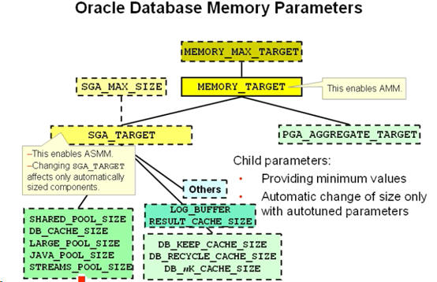
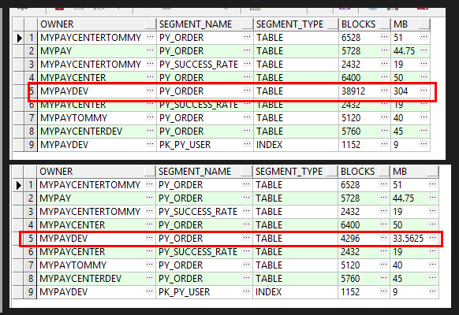

# oracle自动内存


##  Using Automatic Memory Management(开启内存自动管理) Memory_max_target 与 Memory_target 使用介绍(11g新特性AMM)

> 11g MEMORY_MAX_TARGET 参数包含两部分内存，一个 System global area (SGA),另一个 system global area(PGA）。很显然在11g 中可已经将PGA 和SGA 一起动态管理了。

> 下面来看看在11g 中Memory_target 设置和不设置对SGA/PGA 的影响：

### 如果Memory_target 设置为非0 值   （自动内存）
> 下面有四种情况来对SGA 和PGA 的大小进行分配

1. sga_target 和 pga_aggregate_target 已经设置大小如果Oracle 中已经设置了参数sga_target 和pga_aggregate_target，则这两个参数将各自被分配为 最小值最为它们的目标值。
Memory_Target =SGA_TARGET+PGA_AGGREGATE_TARGET ，大小和  memory_max_size 一致。

2. sga_target 设置大小， pga_aggregate_target 没有设置大小 那么pga_aggregate_target初始化值=memory_target-sga_target
3. sga_target 没有设置大小， pga_aggregate_target 设置大小  那么sga_target 初始化值=memory_target-pga_aggregate_target
4. sga_target 和 pga_aggregate_target 都没有设置大小 Oracle 11g 中对这种sga_target 和pga_aggregate_target 都没有设定大小的情况下，Oracle将对这两个值没有最小值和默认值。
  Oracle 将根据数据库运行状况进行分配大小。 

         但在数据库启动是会有一个固定比例来分配：
         sga_target =memory_target *60%
         pga_aggregate_target=memory_target *40%


### 如果Memory_target 没有设置或=0 （在11g 中默认为0）(非自动管理)
> 11g 中默认为0 则初始状态下   """"取消"""  了Memory_target 的作用，完全和10g 在内存管理上一致，完全向下兼容。

     （也有三种情况来对SGA 和PGA 的大小进行分配）   
1. SGA_TARGET设置值，则自动调节SGA 中的shared pool,buffer cache,redo log buffer,java pool,larger pool等内存空间的大小。PGA 则依赖pga_aggregate_target 的大小。sga 和pga 不能自动增长和自动缩小。
2. SGA_target 和PGA_AGGREGATE_TARGET  都没有设置SGA 中的各组件大小都要明确设定，不能自动调整各组建大小。PGA不能自动增长和收缩。
3. MEMORY_MAX_TARGET 设置而MEMORY_TARGET =0  这种情况先和10g 一样，不做说明


## 自动内存COMMAND

```
在11g 中可以使用下面看各组件的值
SQL> show parameter target
NAME                                 TYPE        VALUE
------------------------ ----------- ---------------------
archive_lag_target                   integer     0
db_flashback_retention_target        integer     1440
fast_start_io_target                 integer     0
fast_start_mttr_target               integer     0
memory_max_target                    big integer 1024M
memory_target                        big integer 1024M
pga_aggregate_target                 big integer 0
sga_target                           big integer 0


CONN / AS SYSDBA

-- Set the static parameter. Leave some room for possible future growth without restart.
ALTER SYSTEM SET MEMORY_MAX_TARGET = 6G SCOPE = SPFILE;

-- Set the dynamic parameters. Assuming Oracle has full control.
ALTER SYSTEM SET MEMORY_TARGET=6G SCOPE=SPFILE;
ALTER SYSTEM SET PGA_AGGREGATE_TARGET=0 SCOPE=SPFILE;
ALTER SYSTEM SET SGA_TARGET=0 SCOPE=SPFILE;

-- Restart instance.
SHUTDOWN IMMEDIATE;
STARTUP;
SHOW PARAMETER TARGET

-- 如果需要监视Memory_target 的状况则可以使用下面三个动态试图：
   V$MEMORY_DYNAMIC_COMPONENTS
   V$MEMORY_RESIZE_OPS 
   v$memory_target_advice 


```



-----

## oracle11g数据库有三种预定义的自动维护任务：

```
1. Automatic Optimizer Statistics Collection：
2. Automatic Segment Advisor  www.2cto.com  
3. Automatic SQL Tuning Advisor（这个是oracle 11g新添加的自动维护任务）
select * from dba_autotask_client;


-- 可以通过查询视图DBA_AUTOTASK_HISTORY追踪job运行情况
select * from dba_autotask_job_history order by JOB_START_TIME desc;
```


-------------------------
## oracle 降低高水位（HWM）

[Oracle HWM對SQL效能的影響](https://oolamaru.wordpress.com/2017/09/09/oracle-hwm%E5%B0%8Dsql%E6%95%88%E8%83%BD%E7%9A%84%E5%BD%B1%E9%9F%BF/)

[Oracle段收缩功能](http://www.cnblogs.com/jyzhao/p/5150772.html)

> HWM 對於 Performance 的影響是, 當 full table scan 時, 用此標示決定這一個 segment 是否已經讀取完畢, 所以當 HWM 所指示所在已使用 blocks 內其實有很多碎片空間, 會造成讀取很多不必要的空白 blocks. 

```
-- 检查db blocks
SELECT OWNER,
       SEGMENT_NAME,
       SEGMENT_TYPE,
       BLOCKS,
       TO_CHAR(BYTES / 1024 / 1024) "MB"
  FROM DBA_SEGMENTS
 WHERE 1 = 1
   AND SEGMENT_NAME LIKE '%PY_%'
   AND BLOCKS > 1024;


-- 收缩段核心步骤：

1. 启用行移动
  alter table MYPAYDEV.PY_ORDER enable row movement;
2. 与大多数Oracle SQL命令不同，添加COMPACT关键字后，实际执行的操作不多反少，即HWM不移动
  alter table MYPAYDEV.PY_ORDER shrink space compact;
2. 去掉COMPACT关键字后，执行HWM移动
  alter table MYPAYDEV.PY_ORDER shrink space;
4. 禁用行移动
  alter table MYPAYDEV.PY_ORDER disable row movement;


-- rebuild
alter index PK_PY_USER rebuild online;
```



-------------------------

## 查看数据文件的使用情况

> 2129053个BLOCK，一个BLOCK是8K = 16.24G

```


-- 检查高水位
SELECT /*+ ordered use_hash(a,b,c) */
 A.FILE_ID, -- 文件编号
 A.FILE_NAME, -- 文件名称
 A.FILESIZE, -- 数据文件占用磁盘空间大小
 B.FREESIZE, -- 文件中被标记为free的空间大小
 (A.FILESIZE - B.FREESIZE) USEDSIZE, -- 使用的空间大小
 C.HWMSIZE, -- 已经分配出去的空间大小
 C.HWMSIZE - (A.FILESIZE - B.FREESIZE) UNSEDSIZE_BELOWHWM, -- 在HWM（高水位标记线之下的空闲空间数），这个是理论上的可以回收的空间大小。
 A.FILESIZE - C.HWMSIZE CANSHRINKSIZE -- 这个是实际大小与HWM标记之间的差，就是还没有分配出去的空间大小。
  FROM (SELECT FILE_ID, FILE_NAME, ROUND(BYTES / 1024 / 1024) FILESIZE
          FROM DBA_DATA_FILES) A,
       (SELECT FILE_ID, ROUND(SUM(DFS.BYTES) / 1024 / 1024) FREESIZE
          FROM DBA_FREE_SPACE DFS
         GROUP BY FILE_ID) B,
       (SELECT FILE_ID, ROUND(MAX(BLOCK_ID) * 8 / 1024) HWMSIZE
          FROM DBA_EXTENTS
         GROUP BY FILE_ID) C
 WHERE A.FILE_ID = B.FILE_ID
   AND A.FILE_ID = C.FILE_ID
 ORDER BY UNSEDSIZE_BELOWHWM DESC;


-- 表空间大小
SELECT TABLESPACE_NAME, TO_CHAR(SUM(BYTES) / 1024 / 1024) MB
  FROM DBA_FREE_SPACE
 GROUP BY TABLESPACE_NAME;


-- 收缩空闲表空间
SELECT /*+ ordered use_hash(a,c) */
 'alter database datafile ''' || A.FILE_NAME || ''' resize ' ||
 ROUND(A.FILESIZE - (A.FILESIZE - C.HWMSIZE - 100) * 0.8) || 'M;',
 A.FILESIZE,
 C.HWMSIZE
  FROM (SELECT FILE_ID, FILE_NAME, ROUND(BYTES / 1024 / 1024) FILESIZE
          FROM DBA_DATA_FILES) A,
       (SELECT FILE_ID, ROUND(MAX(BLOCK_ID) * 8 / 1024) HWMSIZE
          FROM DBA_EXTENTS
         GROUP BY FILE_ID) C
 WHERE A.FILE_ID = C.FILE_ID
   AND A.FILESIZE - C.HWMSIZE > 100;
 
-- TABLESPACE 有那些表
 SELECT UT.TABLESPACE_NAME, UT.TABLE_NAME, UT.NUM_ROWS, UT.BLOCKS, UT.*
   FROM USER_TABLES UT

-- 检查 TABLESPACE 是否开启自动扩展
SELECT FILE_NAME, TABLESPACE_NAME, BYTES / 1024, AUTOEXTENSIBLE, STATUS
  FROM DBA_DATA_FILES
 ORDER BY TABLESPACE_NAME;


-- TABLESPACE自动扩展命令（Alter Oracle for autoextend on）  
SELECT 'alter database datafile ' || FILE_NAME || ' ' ||
       ' autoextend on maxsize unlimited;'
  FROM DBA_DATA_FILES;


```


-------------------------