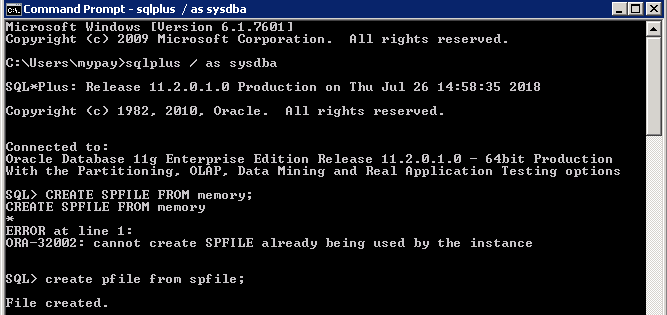
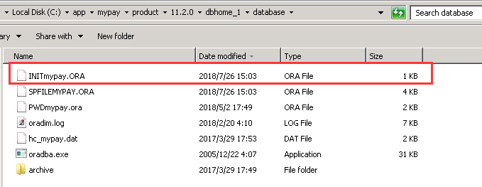
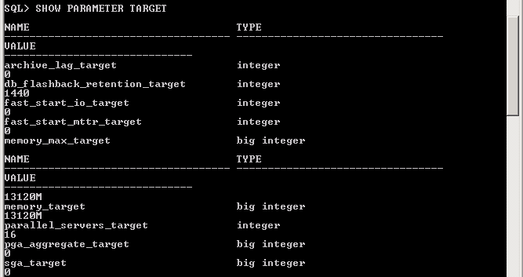
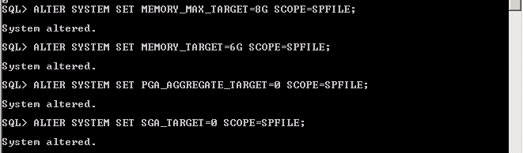
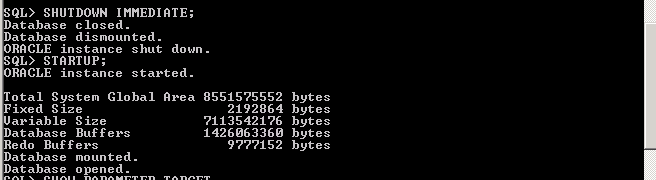
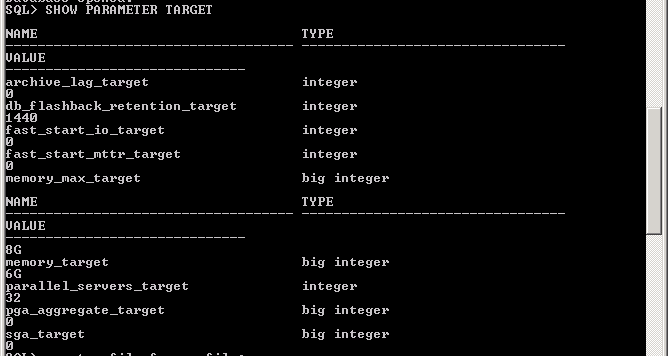
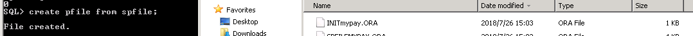

# Database Administrator's Guide

## login

```
sqlplus / as sysdba
```


## 备份oracle启动文件 spfile to pfile

> oracle启动文件位置 C:\app\mypay\product\11.2.0\dbhome_1\database\

```
create pfile from spfile;
```






## 查询目前设定数值

```
SHOW PARAMETER TARGET
```




## 变更oracle 记忆体

```
ALTER SYSTEM SET MEMORY_MAX_TARGET=8G SCOPE=SPFILE;
```

## 把记忆体管体交接oracle自动调整

```
ALTER SYSTEM SET MEMORY_TARGET=6G SCOPE=SPFILE;
ALTER SYSTEM SET PGA_AGGREGATE_TARGET=0 SCOPE=SPFILE;
ALTER SYSTEM SET SGA_TARGET=0 SCOPE=SPFILE;
```




## 关闭oracle

```
SHUTDOWN IMMEDIATE;
```

## 启动oracle

```
STARTUP;
```




## 确认参数

```
SHOW PARAMETER TARGET
```




## 备份pfile

```
create pfile from spfile;
```

## 执行中发生错误，无法起动需要使用pfile重启oracle

```
startup pfile='C:\app\mypay\product\11.2.0\dbhome_1\database\INITmypay.ORA';
```


