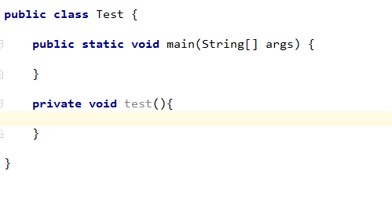

# idea

### CTRL + SHIFT + ENTER 在当前行任何地方可以快速在末尾生成分号；


[技巧](https://mp.weixin.qq.com/s?__biz=MzI3ODcxMzQzMw==&mid=2247484370&idx=1&sn=8a091d43b1af8cae35256be22ff44193&chksm=eb5386e4dc240ff2834261929d96402822a29919a8a2098063ccb74513296d13f05e768ea496&scene=21#wechat_redirect)

[常用配置](https://mp.weixin.qq.com/s?__biz=MzI3ODcxMzQzMw==&mid=2247486604&idx=1&sn=3e284f05c191ab403486f8dabedd8f83&chksm=eb5389badc2400acc002652a862c7461b5d2beaa4934c408e2f06e98d9554e683b70125c42fb&scene=21#wechat_redirect)

[隐藏好用的小技巧](https://mp.weixin.qq.com/s?__biz=MzI3ODcxMzQzMw==&mid=2247486192&idx=1&sn=27040ef95c8dfcd72f1ecb1136d288a5&chksm=eb538fc6dc2406d0f1e34e6d53f21dc1949fc1f09f1d52eba107c7d6cbf1e80dda75036e773a&scene=21#wechat_redirect)


---


## idea 设定 （idea64.exe.vmoptions）

```
-Xms1024m
-Xmx2048m
-XX:ReservedCodeCacheSize=240m
-XX:+UseConcMarkSweepGC
-XX:SoftRefLRUPolicyMSPerMB=50
-ea
-Dsun.io.useCanonCaches=false
-Djava.net.preferIPv4Stack=true
-XX:+HeapDumpOnOutOfMemoryError
-XX:-OmitStackTraceInFastThrow
-Duser.language=en
-Dfile.encoding=UTF-8
-javaagent:D:\install\JetBrains\JetbrainsCrack-2.6.10-release-enc.jar
```

## 变更默认配置目录


## tomcat (VM options)
```
-Dfile.encoding=UTF-8 -noverify -agentpath:C:/Users/yu_da/.jrebel/jrebel64.dll 

```


## 不区分大小写


## 不区分大小写


