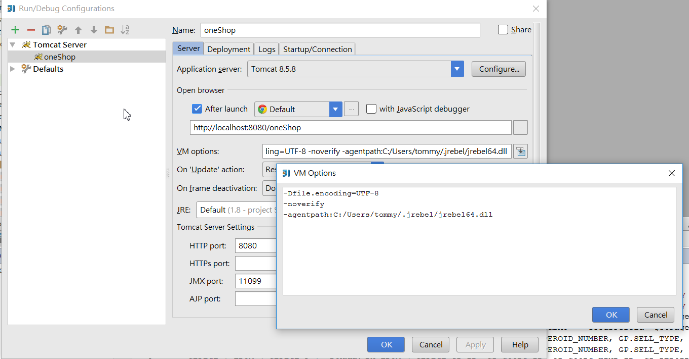
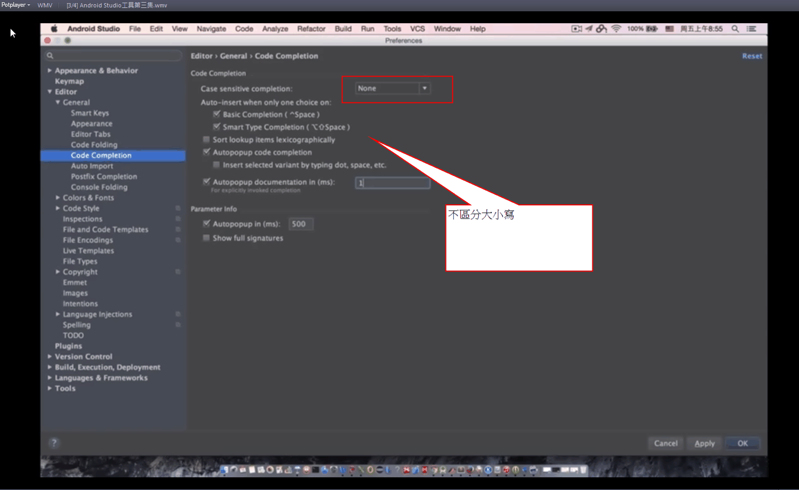
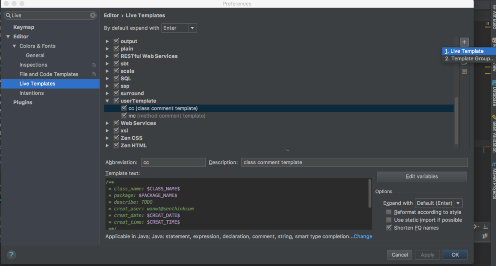

# idea 设定 （idea64.exe.vmoptions）

```
-Xms1024m
-Xmx2048m
-XX:ReservedCodeCacheSize=240m
-XX:+UseConcMarkSweepGC
-XX:SoftRefLRUPolicyMSPerMB=50
-ea
-Dsun.io.useCanonCaches=false
-Djava.net.preferIPv4Stack=true
-XX:+HeapDumpOnOutOfMemoryError
-XX:-OmitStackTraceInFastThrow
-Duser.language=en
-Dfile.encoding=UTF-8
-javaagent:D:\install\JetBrains\JetbrainsCrack-2.6.10-release-enc.jar
```


## tomcat (VM options)
```
-Dfile.encoding=UTF-8 -noverify -agentpath:C:/Users/yu_da/.jrebel/jrebel64.dll 

```



## 不区分大小写


## 不区分大小写



