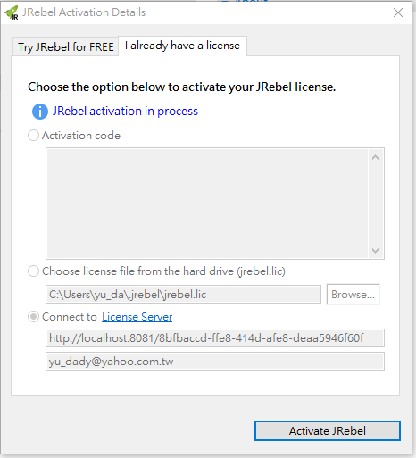

# jrebel

```
-Dfile.encoding=UTF-8 -noverify -agentpath:C:/Users/yu_da/.jrebel/jrebel64.dll 
```


## rebel.xml(Intellij)
```
<?xml version="1.0" encoding="UTF-8"?>
<application xmlns:xsi="http://www.w3.org/2001/XMLSchema-instance" xmlns="http://www.zeroturnaround.com" xsi:schemaLocation="http://www.zeroturnaround.com http://www.zeroturnaround.com/alderaan/rebel-2_0.xsd">

	<classpath>
		<dir name="D:/zonvan/coding/myPay/out/artifacts/myPay/WEB-INF/classes">
		</dir>
	</classpath>

	<web>
		<link target="/">
			<dir name="D:/zonvan/coding/myPay/out/artifacts/myPay">
			</dir>
		</link>
	</web>

</application>
```


# Jrebel & Jet Brains License Server for Java

```
intellij licence server => http://localhost:8081
jrebel licence server => http://localhost:8081/88414687-3b91-4286-89ba-2dc813b107ce

intellij jrebel plugin => jr-ide-intellij-2018.1.0_13-17.zip
```


A license server for Jrebel & JetBrains products, it also support JRebel for Android and XRebel.

## JREBEL 2018.1 激活教程 



## [jrebej licence server](https://gitee.com/gsls200808/JrebelLicenseServerforJava)


授权地址增加了GUID检测

使用 http://xxx.com:8888/jrebelusername 这样的地址无法激活了
需要修改为 http://xxx.com:8888/88414687-3b91-4286-89ba-2dc813b107ce 这样的地址

如：http://yudady.tplinkdns.com:8081/88414687-3b91-4286-89ba-2dc813b107ce

如：


http://yudady.tplinkdns.com:8081/88414687-3b91-4286-89ba-2dc813b107ce
http://yudady.tplinkdns.com:8081/da03b038-8c9c-44f5-926f-8bda0296712f
http://192.168.168.150:8081/da03b038-8c9c-44f5-926f-8bda0296712f
后面的那串为GUID，随便找个GUID在线生成器生成个就行了

从老版本升级到该版本的不受影响，激活后一定手动要切换到离线模式，可离线180天，可随时重点下，180天周期会重新刷新

