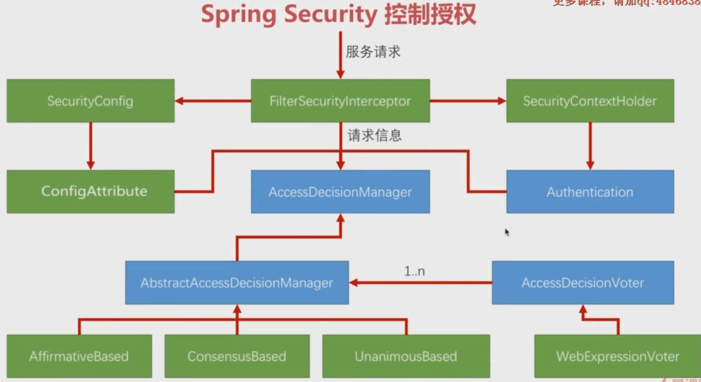

# Spring security

1. HttpSecurity
        SecurityConfigurerAdapter
            DefaultLoginPageConfigurer
            AnonymousConfigurer
            CorsConfigurer
            XXXConfigurer


---

1. AbstractAuthenticationProcessingFilter(主要处理登录)
2. FilterSecurityInterceptor(主要处理鉴权)
> SecurityContextPersistenceFilter主要是为这两个filter准备context。

## 認證


## 授權


[Spring Security授权过程](http://niocoder.com/2018/01/05/Spring-Security%E6%BA%90%E7%A0%81%E5%88%86%E6%9E%90%E4%BA%8C-Spring-Security%E6%8E%88%E6%9D%83%E8%BF%87%E7%A8%8B/)

[聊聊FilterSecurityInterceptor](https://segmentfault.com/a/1190000012465134)




```
http.authorizeRequests().antMatchers("/user/{userId}/**").access("@@webSecurity.checkUserId(authentication,#userId)")
```


