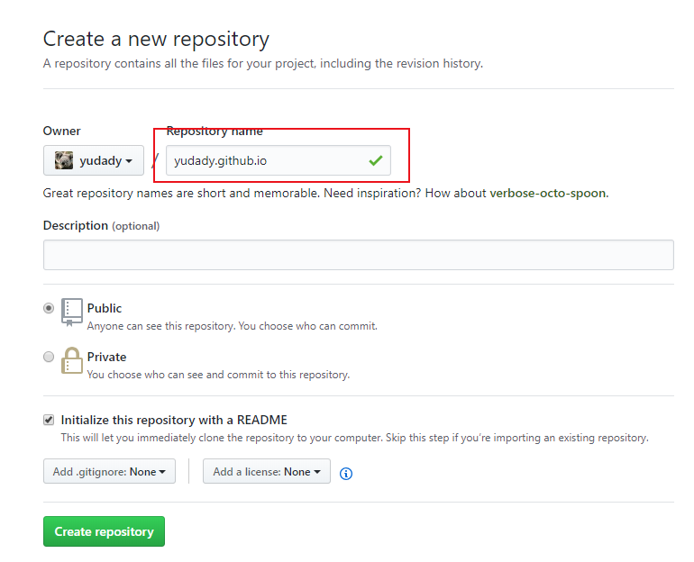
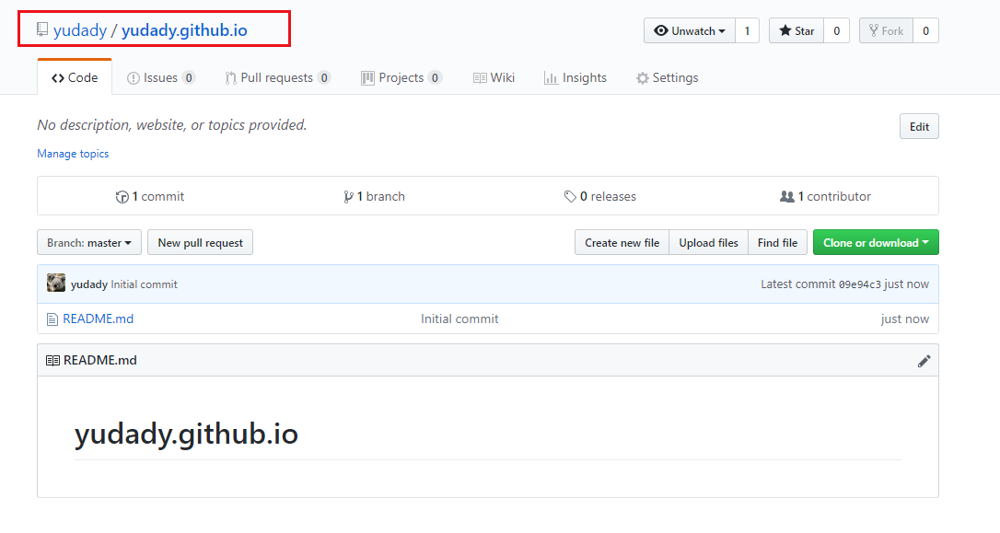
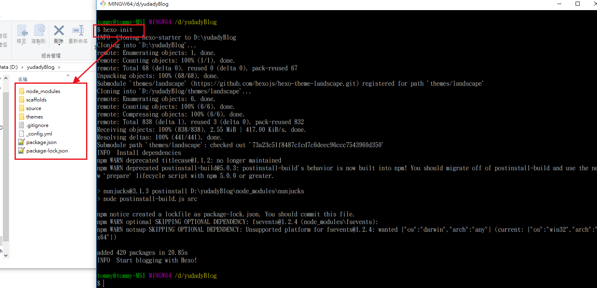
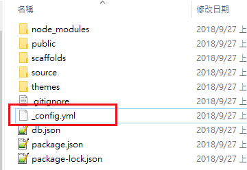
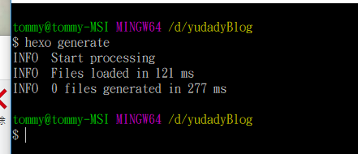
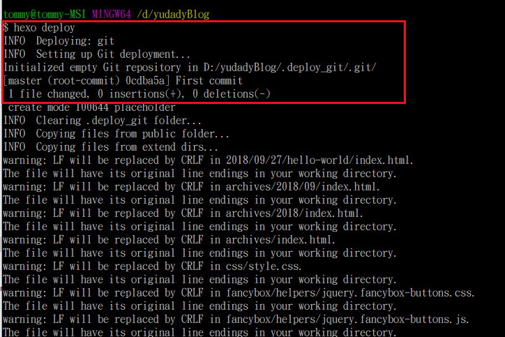
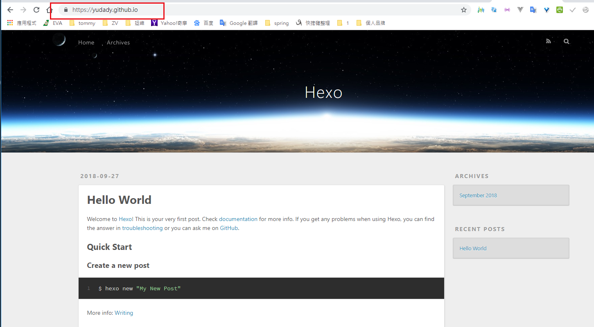

# 使用 Hexo + github 建立Blog

## github
> 我的github賬號 yudady
> 
> 創建一個 yudady.github.io
> 
> 

## Hexo
> mkdir yudadyBlog
> cd yudadyBlog
> npm install -g hexo
> 
> hexo init
> 
> npm install
> 
> hexo generate
> 

## 修改要部署到github的URL（_config.yml）
> 
> 

## 準備depoly [Hexo](https://hexo.io/zh-tw/docs/deployment.html)
> npm install hexo-deployer-git --save
> 
> 
> hexo generate
> 
> hexo deploy
> 

## 我的網址  https://yudady.github.io/

