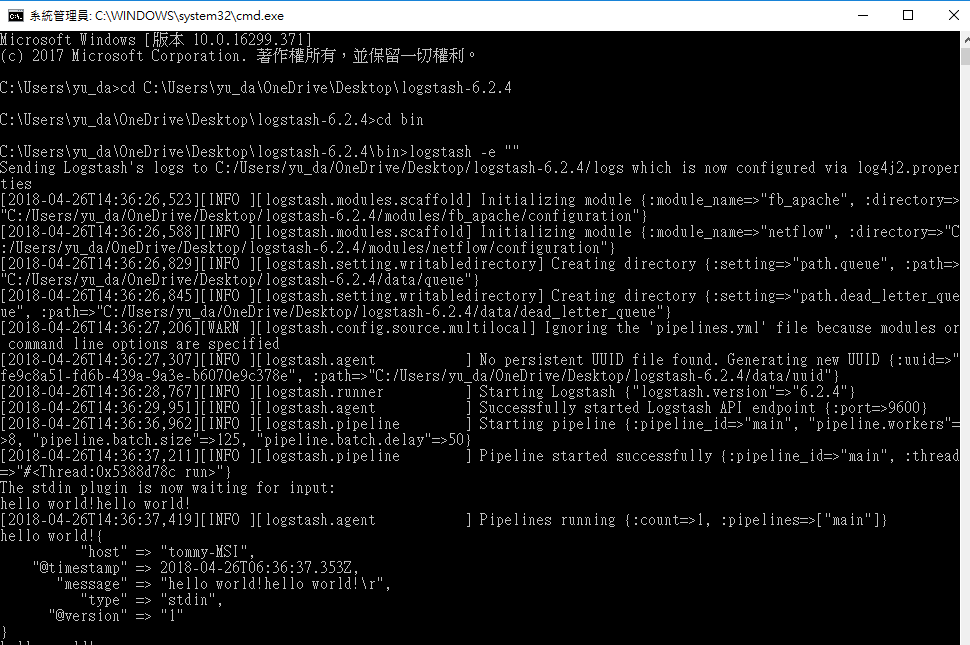

# logstash测试

通过命令行，进入到logstash/bin目录，执行下面的命令：

logstash -e ""



## 测试conf档案
logstash -f setting.conf --config.test_and_exit

## 执行logstash使用setting.conf
logstash -f setting.conf

```
input {
    file {
        path => "C:/Users/yu_da/OneDrive/Desktop/logstash-6.2.4/bin/callback-json-2018-04-24.log"
		start_position => "beginning"
		type => "zonpay"
		codec => json {
			charset => "UTF-8"
		}

    }
}


output {
    stdout {
        codec => rubydebug
    }
}


```


## GCP server
```
/usr/share/logstash/bin/logstash  -f serverLog4j.conf --config.test_and_exit

/usr/share/logstash/bin/logstash -f /etc/logstash/conf.d/serverLog4j.conf --path.logs /var/log/logstash/ > /var/log/logstash/111.log &

```
