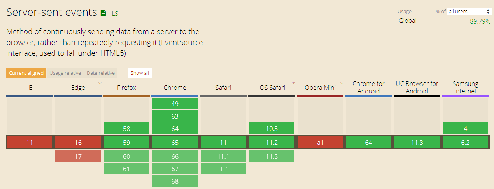
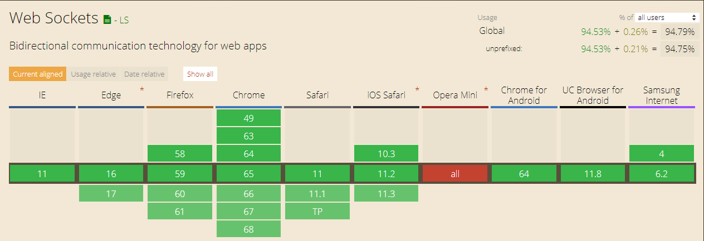

# server 需要傳送訊息給 client

## ajax andn setInterval，輪詢資料
```
setInterval(function(){
  $.getJSON( "ajax/test.json", function( data ) {
    console.log(data);
  });
},1000);

```


## ajax readyStatus=3 ， 連接上server後，保持不斷線 ， 長連接

```
xhr.onreadystatechange = function(){ 
   if(xhr.readyState == 3){
      console.log("readyState response length " + xhr.response.length);
   }
} 
```


## html5後，Server-Sent Events 與 WebSocket？

1. Server-Sent Events（安全第一）
> Server-Sent Events 瀏覽器不太需要傳送資料給伺服器，瀏覽器只是負責接收資料而已，例如股市行情、即時新聞等，這個時候就可以使用 SSE 這種單向的傳輸方式，如果偶爾需要傳送少量的資訊給伺服器時，也可以使用傳統的 XMLHttpRequest 來處理。SSE 則是一種架構在傳統的 HTTP 協定之上的傳輸方式，也就是說你可以在不需要加裝任何特別的通訊協定或伺服器軟體即可直接使用 SSE，另外 SSE 也有一些 WebSocket 所沒有的特性，例如自動重新連線、事件 ID 與傳送任意的事件等，這些都是 SSE 才有的優點。


2. WebSocket （W3C標準）
> WebSocket 提供了雙向（bi-directional）且全雙工（full-duplex）的優異傳輸能力，這樣的架構非常適合用於線上遊戲、聊天程式或是各種需要即時雙向傳輸的應用


## SSE 瀏覽器端實作

接下來我們要開始介紹如何使用 SSE，瀏覽器端在使用 SSE 的 API 前，要先確認瀏覽器是否支援，如果瀏覽器有支援，則以資料來源的網址作為參數，建立一個 EventSource 物件：

```
if (!!window.EventSource) {
  var url = "http://localhost:8080/EventSourceServlet"
  var source = new EventSource(url);
  source.onopen = function(){
      console.log('連線已建立',this.readyStatus);
  }
  source.onmessage = function(event){
      console.log('從服務器拿到的資料',event);
  }
  source.onerror = function(event){
      
  }

} else {
  // 瀏覽器不支援 SSE，使用傳統的 xhr polling :(
}


```

## SSE 伺服器範例

```
import java.io.IOException;
import java.io.PrintWriter;

import javax.servlet.ServletException;
import javax.servlet.http.HttpServlet;
import javax.servlet.http.HttpServletRequest;
import javax.servlet.http.HttpServletResponse;

public class EventSourceServlet extends HttpServlet {

	public void doGet(HttpServletRequest request, HttpServletResponse response)
			throws ServletException, IOException {

		response.setContentType("text/event-stream"); // 重點
		response.setCharacterEncoding("UTF-8");

		PrintWriter writer = response.getWriter();

		for (int i = 0; i < 20; i++) {

			writer.write("data: "+ System.currentTimeMillis() +"\n\n");
			writer.flush();
			
			try {
				Thread.sleep(1000);
			} catch (InterruptedException e) {
				e.printStackTrace();
			}
		}
		writer.close();
	}

}
```





## WebSocket 瀏覽器端實作

```
var websocket = new WebSocket("ws://localhost:8080/websocketendpoint");

websocket.onopen = function(evt) { 
    console.log("連線成功");
};
websocket.onclose = function(evt) {
    
};
websocket.onmessage = function(evt) {
    console.log('從伺服器接收訊息',evt.data);
};
websocket.onerror = function(evt) {
    
};


// send to server
websocket.send("這是伺服器正迫切需要的文字！");


```


## WebSocket 伺服器範例

```
import javax.websocket.OnClose;
import javax.websocket.OnError;
import javax.websocket.OnMessage;
import javax.websocket.OnOpen;
import javax.websocket.server.ServerEndpoint;

@ServerEndpoint("/websocketendpoint")
public class WsServer {
	
	@OnOpen
	public void onOpen(){
		System.out.println("Open Connection ...");
	}
	
	@OnClose
	public void onClose(){
		System.out.println("Close Connection ...");
	}
	
	@OnMessage
	public String onMessage(String message){
		System.out.println("Message from the client: " + message);
		String echoMsg = "Echo from the server : " + message;
		return echoMsg;
	}

	@OnError
	public void onError(Throwable e){
		e.printStackTrace();
	}

}
```


