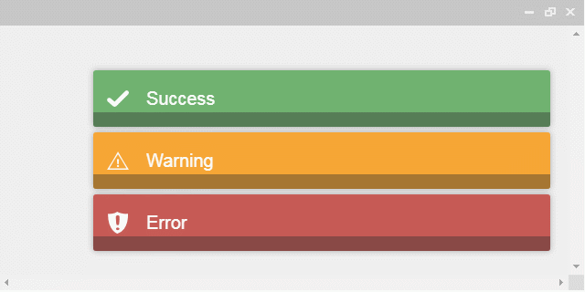

# toastr - 簡易提示訊息



```
  <!-- jQuery v1.9.1 -->
  <script src="https://code.jquery.com/jquery-1.9.1.min.js"></script>
  <!-- toastr v2.1.4 -->
  <link href="https://cdnjs.cloudflare.com/ajax/libs/toastr.js/2.1.4/toastr.min.css" rel="stylesheet"  />
  <script src="https://cdnjs.cloudflare.com/ajax/libs/toastr.js/2.1.4/toastr.min.js"></script>
```

## 範例
- 右下角顯示提示訊息
```
<script>
  	toastr.options = {
  		// 參數設定[註1]
  		"closeButton": false, // 顯示關閉按鈕
  		"debug": false, // 除錯
  		"newestOnTop": false,  // 最新一筆顯示在最上面
  		"progressBar": true, // 顯示隱藏時間進度條
  		"positionClass": "toast-bottom-left", // 位置的類別
  		"preventDuplicates": false, // 隱藏重覆訊息
  		"onclick": null, // 當點選提示訊息時，則執行此函式
  		"showDuration": "300", // 顯示時間(單位: 毫秒)
  		"hideDuration": "1000", // 隱藏時間(單位: 毫秒)
  		"timeOut": "5000", // 當超過此設定時間時，則隱藏提示訊息(單位: 毫秒)
  		"extendedTimeOut": "1000", // 當使用者觸碰到提示訊息時，離開後超過此設定時間則隱藏提示訊息(單位: 毫秒)
  		"showEasing": "swing", // 顯示動畫時間曲線
  		"hideEasing": "linear", // 隱藏動畫時間曲線
  		"showMethod": "fadeIn", // 顯示動畫效果
  		"hideMethod": "fadeOut" // 隱藏動畫效果
  	}
  	toastr.success( "Success" );
  	toastr.warning( "Warning" );
  	toastr.error( "Error" );
  </script>
```


