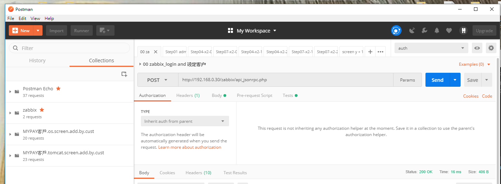

# postman




## 变量.證邏輯

[驗證邏輯](postman.寫驗證邏輯.pdf)

```
// 将返回信息解析成对象
var responseData = JSON.parse(responseBody);
console.log(responseData.result);
// 设置环境变量
pm.environment.set("auth", responseData.result );


var custNum = "060";
console.log(custNum);
pm.environment.set("custNum", custNum);
```


## 参考资料
[PostmanAPI自动化测试利器](PostmanAPI自动化测试利器.pdf)

[利用 POSTMAN 中的 collection 來快速測試 application 功能是否正常](POSTMAN.collection.pdf)

