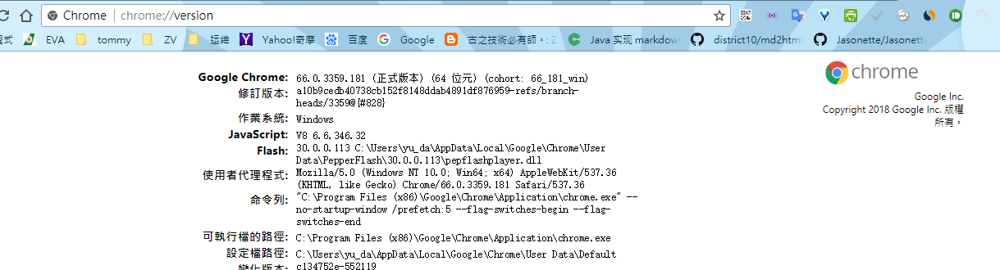
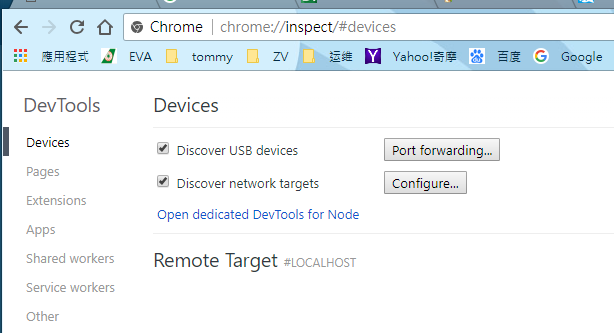
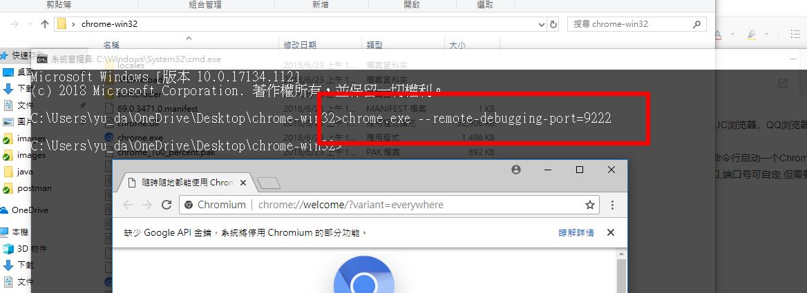
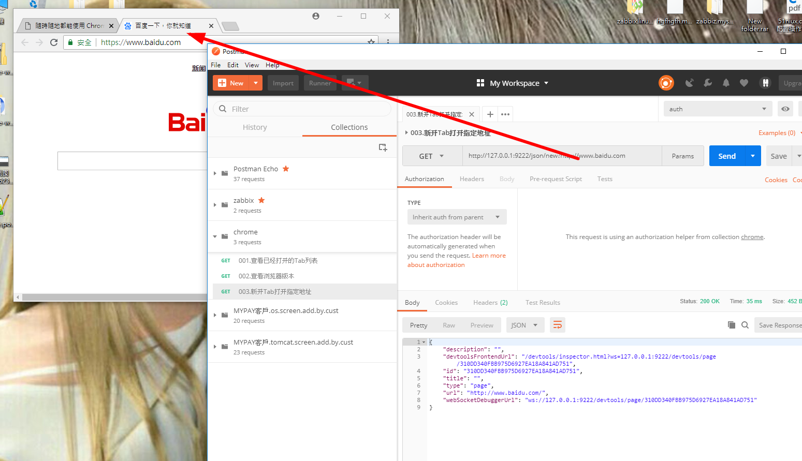
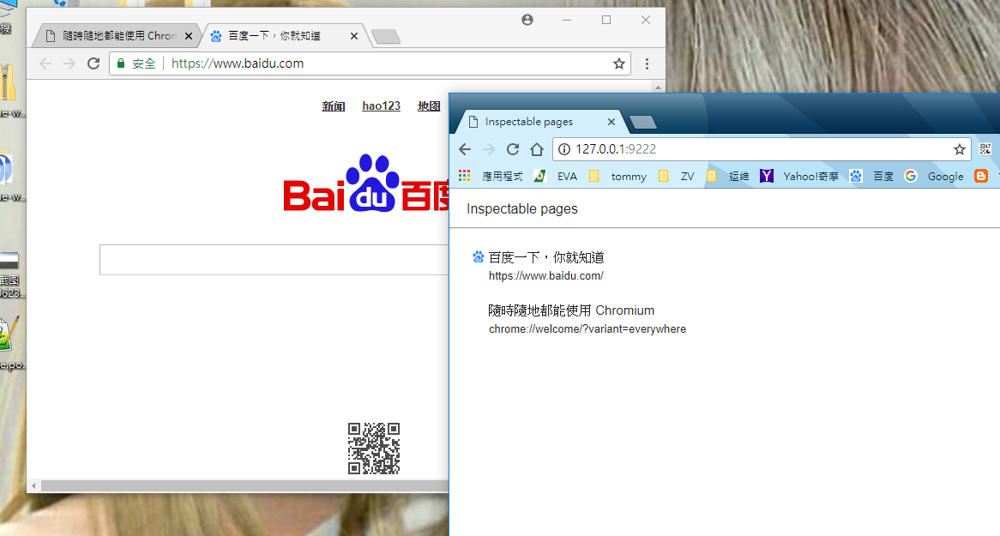
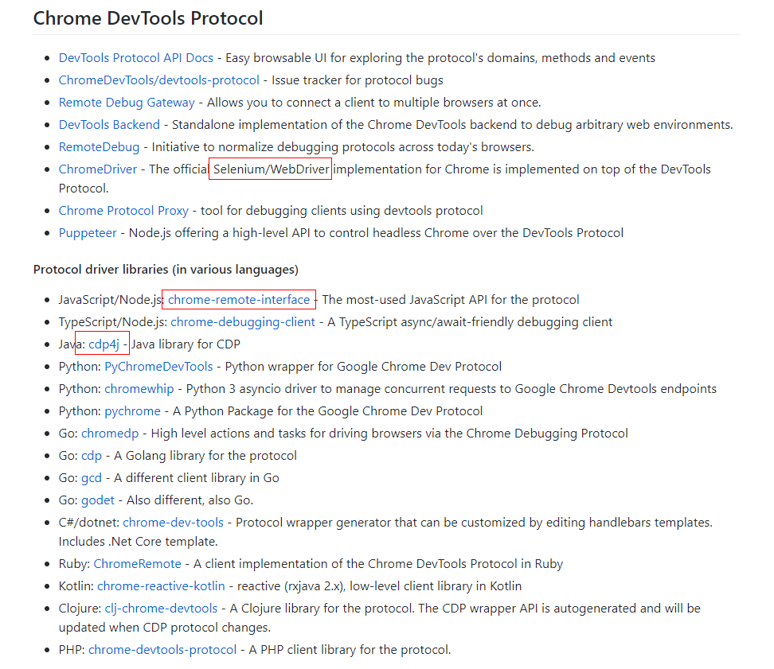

# about chrome 远程调试协议
[远程调试协议](https://chromedevtools.github.io/devtools-protocol/1-3/)

## chrome version


## chrome inspect


## chromium 
[download chromium](https://download-chromium.appspot.com/)

### 开启
```
chrome.exe --remote-debugging-port=9222 
--user-data-dir=.
```


### postman操作chrome-remote-debugging
1. 查看已经打开的Tab列表 http://127.0.0.1:9222/json 
2. 查看浏览器版本信息 http://127.0.0.1:9222/json/version
3. 新开Tab打开指定地址 http://127.0.0.1:9222/json/new?http://www.baidu.com




关闭一个标签页，传入该页面的id。
http://localhost:9222/json/close/477810FF-323E-44C5-997C-89B7FAC7B158
激活标签页。
http://localhost:9222/json/activate/477810FF-323E-44C5-997C-89B7FAC7B158


### 打开 chrome remote 模拟器 ui




http://127.0.0.1:9222/devtools/inspector.html?ws=127.0.0.1:9222/devtools/page/837A99A81C7DF39D62C1971FFED2CDDD

### 使用 port转发
open Chrome in one console: google-chrome --remote-debugging-port=9222
and set up a proxy in another one: ssh -L 0.0.0.0:9223:localhost:9222 localhost -N
now you should be able to access remote debugging from another machine via http://192.168.1.123:9223/


netsh.exe interface portproxy add v4tov4 listenaddress=127.0.0.1 listenport=9222 connectaddress=192.168.0.135 connectport=9223


netsh.exe interface portproxy add v4tov4 listenaddress=ourdomain2.dev listenport=80 connectaddress=192.168.10.10 connectport=8888


## 参考资料
[Chrome之远程调试协议（Remote debugging protocol）](https://div.io/topic/1464)

https://github.com/ChromeDevTools/awesome-chrome-devtools#chrome-devtools-protocol



