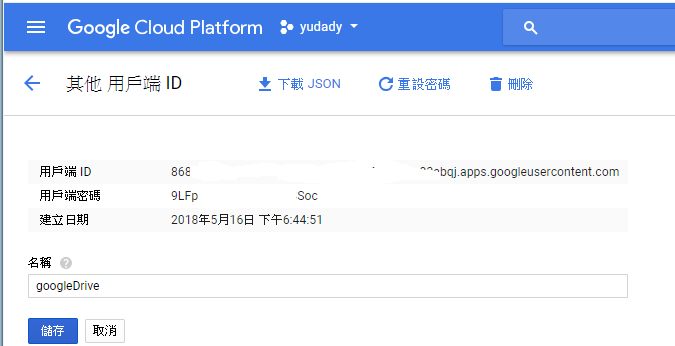
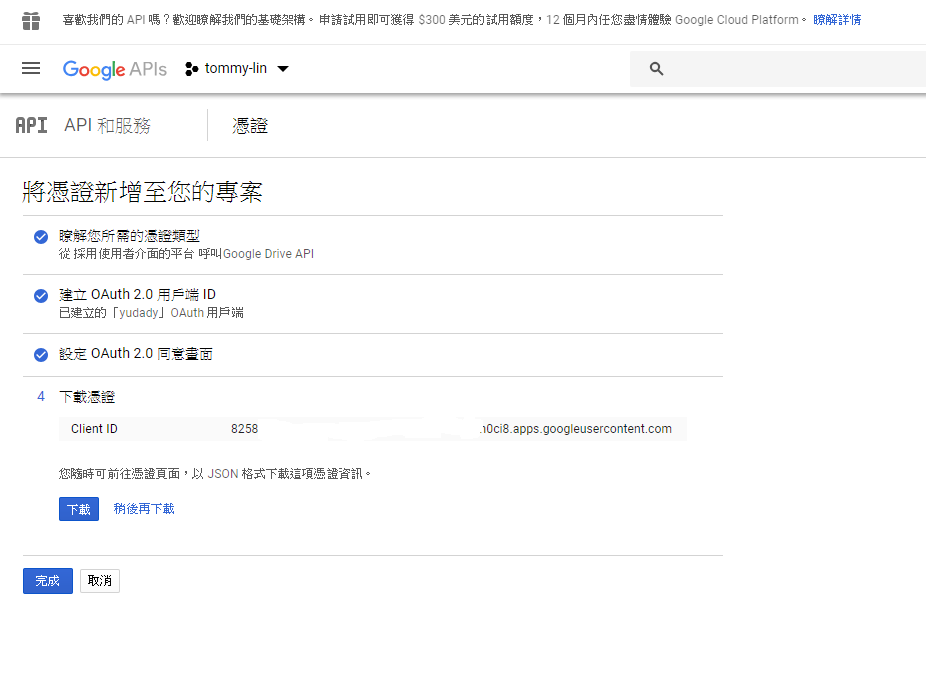

# GOOGLE

[第一次接觸Google API就上手](https://www.ithome.com.tw/guest-post/98590)

[
Using OAuth 2.0 to Access Google APIs](https://developers.google.com/identity/protocols/OAuth2)

## OAuth2

[Google OAuth2 Sign-In - Spring Boot Security in Google Cloud Platform](https://www.youtube.com/watch?v=00-hMP2KKSs)

[使用Google OAuth 2.0 存取Google API](http://blog.kenyang.net/2012/09/15/google-oauth-20-google-api)

> 可以下载 key
---

https://developers.google.com/sheets/api/quickstart/java
https://github.com/webcane/google-spreadsheet-api-samples

