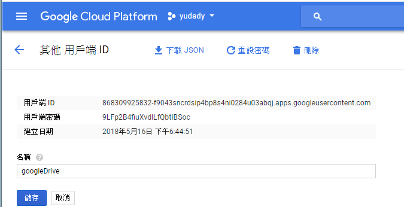

# GOOGLE

[第一次接觸Google API就上手](https://www.ithome.com.tw/guest-post/98590)

[
Using OAuth 2.0 to Access Google APIs](https://developers.google.com/identity/protocols/OAuth2)

[Google OAuth2 Sign-In - Spring Boot Security in Google Cloud Platform](https://www.youtube.com/watch?v=00-hMP2KKSs)

[使用Google OAuth 2.0 存取Google API](http://blog.kenyang.net/2012/09/15/google-oauth-20-google-api)

---

{
	"installed": {
		"client_id": "868309925832-f9043sncrdsip4bp8s4ni0284u03abqj.apps.googleusercontent.com",
		"project_id": "yudady",
		"auth_uri": "https://accounts.google.com/o/oauth2/auth",
		"token_uri": "https://accounts.google.com/o/oauth2/token",
		"auth_provider_x509_cert_url": "https://www.googleapis.com/oauth2/v1/certs",
		"client_secret": "9LFp2B4fiuXvdlLfQbtIBSoc",
		"redirect_uris": ["urn:ietf:wg:oauth:2.0:oob",
		"http://localhost"]
	}
}