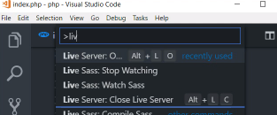
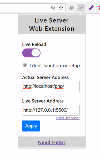
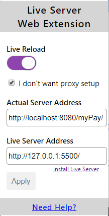

# live-server 同步小工具
1. npm init -y 初始化专案
2. npm install -g [live-server](https://github.com/tapio/live-server)
3. [live-server实现本地服务器+自动刷新](https://www.jianshu.com/p/aa52518e706f)
4. [chrome Live Server Web Extension](https://chrome.google.com/webstore/detail/live-server-web-extension/fiegdmejfepffgpnejdinekhfieaogmj)
5. [markdown auto-reload chrome plugin](https://chrome.google.com/webstore/detail/markdown-preview-plus/febilkbfcbhebfnokafefeacimjdckgl) 写mark时，不要启用chrome plugin 的 proxy
6. [php auto reload](https://www.youtube.com/watch?v=54wcX1G2GH8&feature=youtu.be) 影片使用vsCode编辑PHP，用到http://127.0.0.1:5500/ ， http://127.0.0.1:80/php ， 编辑PHP可以自动刷新页面 
7. [VScode plugin](https://marketplace.visualstudio.com/items?itemName=ritwickdey.LiveServer) 
8. 写在package.json不会起作用 =》 npm run server
9. intellij open cmd 输入 live-server --host=0.0.0.0 --port=5500 设定chrome Live Server Web Extension

----

  

----

 

----

 

