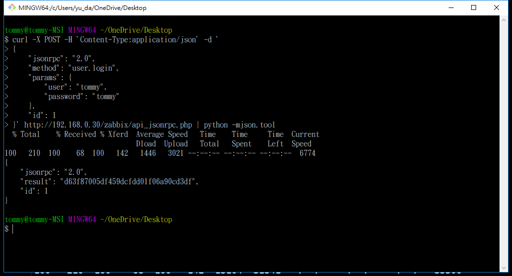

# CURL 命令

[zabbix login](https://www.zabbix.com/documentation/3.4/zh/manual/api/reference/user/login)


> python -mjson.tool 格式化josn
```
curl -X POST -H 'Content-Type:application/json' -d ' 
{
    "jsonrpc": "2.0",
    "method": "user.login",
    "params": {
        "user": "tommy",
        "password": "tommy"
    },
    "id": 1
}' http://192.168.0.30/zabbix/api_jsonrpc.php | python -mjson.tool

```

