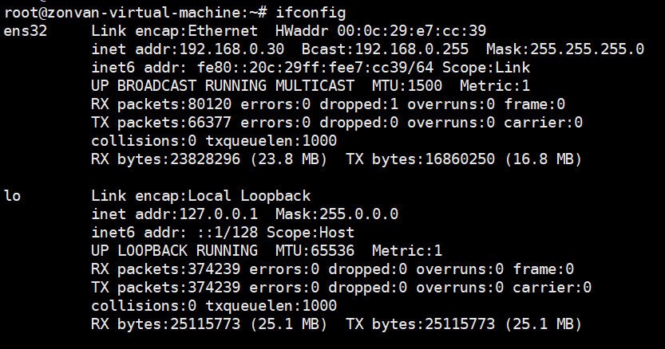
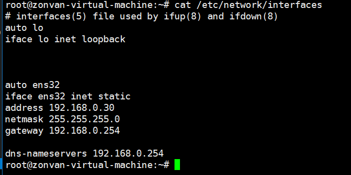
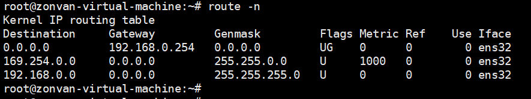

# ubuntu 


## zabbix (192.168.0.30)

-- 重启网路
/etc/init.d/networking restart
-- 检查网路服务
systemctl status networking.service


## 静态IP（编辑 vim /etc/network/interfaces）


```
-- 增加
auto ens32
iface ens32 inet static 
address 192.168.0.30
netmask 255.255.255.0
gateway 192.168.0.254

dns-nameservers 192.168.0.254
```

---



---



---




