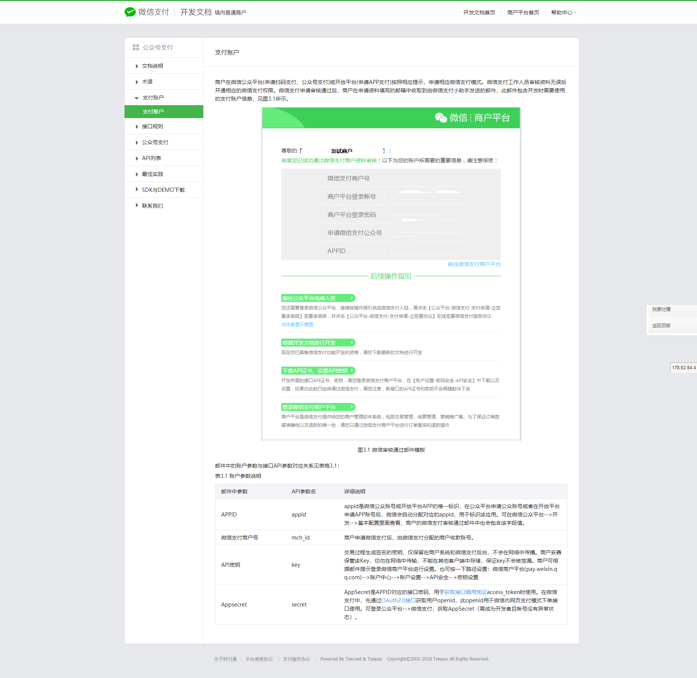
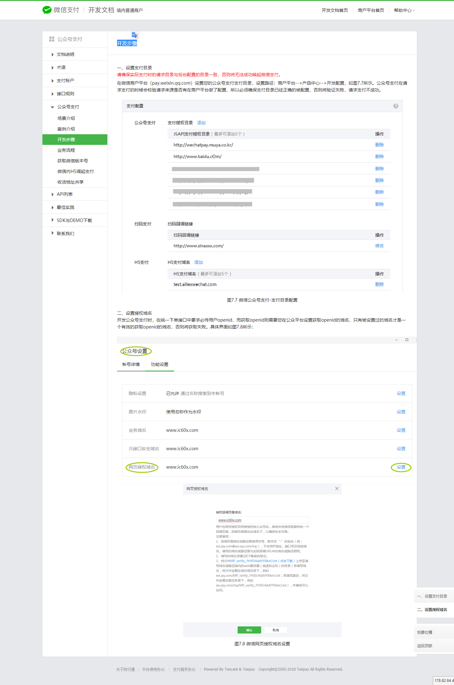

# 微信公众号分为
1. 订阅号
2. 服务号
3. 企业号

[微信网页授权](https://mp.weixin.qq.com/wiki?t=resource/res_main&id=mp1421140842)
> 如果用户在微信客户端中访问第三方网页，公众号可以通过微信网页授权机制，来获取用户基本信息，进而实现业务逻辑。

## [微信网页开发](https://mp.weixin.qq.com/wiki?t=resource/res_main&id=mp1421140842)

## 鉴权 "  www.qq.com   "
配置以后此域名下面的页面
http://www.qq.com/music.html 、 
http://www.qq.com/login.html 
都可以进行OAuth2.0鉴权。但
http://pay.qq.com 、 
http://music.qq.com 、 
http://qq.com 
无法进行OAuth2.0鉴权

## scope
1. snsapi_base (V)
2. snsapi_userinfo

## [流程](https://mp.weixin.qq.com/wiki?t=resource/res_main&id=mp1421140842)

1. 用户同意授权，获取code
2. 通过code换取网页授权access_token
3. 拉取用户信息(需scope为 snsapi_userinfo)
4. [统一下单](https://pay.weixin.qq.com/wiki/doc/api/jsapi.php?chapter=9_1)
5. 组成拉起支付的参数
6. [微信内H5调起支付](https://pay.weixin.qq.com/wiki/doc/api/jsapi.php?chapter=7_7&index=6)

---
[获取openid](https://pay.weixin.qq.com/wiki/doc/api/jsapi.php?chapter=4_4)
> 微信公众平台：openid是微信用户在公众号appid下的唯一用户标识（appid不同，则获取到的openid就不同），可用于永久标记一个用户，同时也是微信公众号支付的必传参数。

---
## 公众号支付
> 公众号支付是用户在微信中打开商户的H5页面，商户在H5页面通过调用微信支付提供的JSAPI接口调起微信支付模块完成支付。应用场景有：
1. 用户在微信公众账号内进入商家公众号，打开某个主页面，完成支付
2. 用户的好友在朋友圈、聊天窗口等分享商家页面连接，用户点击链接打开商家页面，完成支付
3. 将商户页面转换成二维码，用户扫描二维码后在微信浏览器中打开页面后完成支付

## [微信web开发者工具](https://mp.weixin.qq.com/wiki?t=resource/res_main&id=mp1455784140)

##关于特殊场景下的静默授权
1、上面已经提到，对于以snsapi_base为scope的网页授权，就静默授权的，用户无感知；

2、对于已关注公众号的用户，如果用户从公众号的会话或者自定义菜单进入本公众号的网页授权页，即使是scope为snsapi_userinfo，也是静默授权，用户无感知。

具体而言，网页授权流程分为四步：
1、引导用户进入授权页面同意授权，获取code
2、通过code换取网页授权access_token（与基础支持中的access_token不同）
3、如果需要，开发者可以刷新网页授权access_token，避免过期
4、通过网页授权access_token和openid获取用户基本信息（支持UnionID机制）

-------

http://www.1688www.cn/wap/weixinOfficialAccount.jsp     198  (这个有红色告警)

http://www.ml000.cn/wap/weixinOfficialAccount.jsp       199  (这个不会跳出红色告警)

198 提供的参考网站
http://www.joblink360.com/

前台    http://www.1688www.cn/wap/weixinOfficialAccount.jsp 
RD  http://pay.kp69.cn/rd/redirect742.jsp?orderNo=201806301980000004&referrer=http://www.1688www.cn/wap/weixinOfficialAccount.jsp

前台    http://www.ml000.cn/wap/weixinOfficialAccount.jsp 
RD      http://pay.ml000.cn/rd/redirect742.jsp
