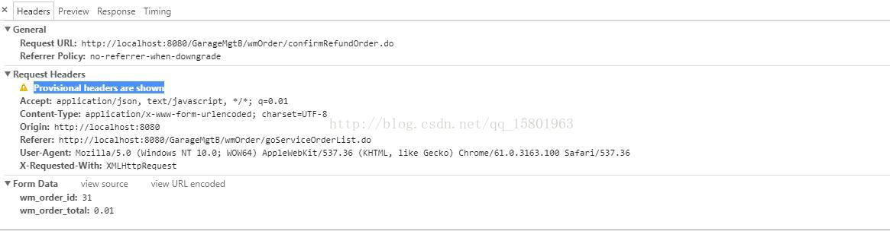

# 解决浏览器 Provisional headers are shown 无法向后台发送请求问题

myPayCenter 被攻击后(发生第3种状况)

> 把在线的request全部砍掉(reset tomcat tmp data)

> 官方解释是，浏览器第一次发送这个请求，请求被阻塞，未收到响应。当要求浏览器再次发送这个请求时，上个同样的请求都还没有收到响应，浏览器就会报这个警告，那么问题会在哪里呢。

## Chrome请求出现"Provisional headers are shown"

1. 所有的客户端的浏览器访问时都一直出现Provisional headers are shown的情况：

处理方式： 检查该请求触发的页面，查看是否有 表单提交 和 ajax请求同时触发的情况，

例如：定义了一个按钮，type是submit，另外又给该按钮定义了一个ajax事件；

这种场景是我们以前开发过程中出现的一种情况

2. 部分客户端的浏览器出现

处理方式：调用chrome的  chrome://net-internals/#events ，然后重新触发一下请求，然后查看出现 Provisional headers are shown 的请求的日志；

查看是否存在 delegate_blocked_by 的关键字；这种一般是由于浏览器端的插件或客户端的软件对请求进行了拦截；我们出现的情况，是被 websense endpoint拦截；

如果是这种情况，基本上可以忽略啦，客户端自身的问题啦；可以考虑将插件或软件卸载后，重新尝试，看是否还出现；如果还出现，请看是否属于以下的情况

3. 所有的客户端都随机偶尔出现过这种错误，如果是这种情况，往往是属于服务器端的问题

 处理方式： 基于部署架构来进行排查；例如：我们的部署架构中 关键的几个流程是 nginx----> 网关应用----> F5负载均衡----> 应用服务器（docker）

可以进行层层排查，简单的方式是直接服务器shell命令 写一个for循环 curl请求，先调用最下层的应用服务器（如果怕压力不够，可以多线程去压）；依次往上去压；在压测的过程中，可以实时的去看，是否会出现请求卡住的情况；如果发现，很大的可能行就是这一层的问题：

目前我们遇到的情况有两块,一个是F5层面，部分请求未成功负载均衡到应用服务器；还有一种情况是nginx层面出现的卡住的情况；

处理方案：F5层面的负载均衡策略 从 performance L4改成了standard； 

nginx层面卡住的情况处理方案：这种情况没有实际去参与过，了解的情况是修改了nginx的很多配置都没有效果，最后直接干掉重装就好啦，所以也没有找到关键点

