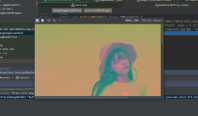
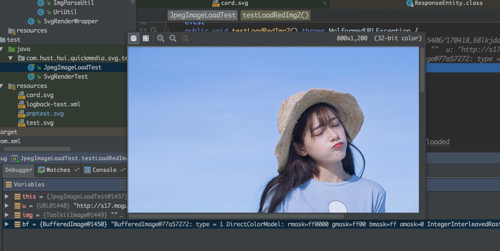

# 图片变红





```
/**
 * 图片读取之后，颜色变红的测试
 */
@Test
public void testLoadRedImg() throws IOException {
    String url = "http://s17.mogucdn.com/mlcdn/c45406/170418_68lkjddg3bll08h9c9bk0d8ihkffi_800x1200.jpg";
    URL u = new URL(url);
    BufferedImage bf = ImageIO.read(u);
    ImageIO.write
    System.out.println("--over--");

}
```


### 为什么会出现这个问题：
> ImageIO.read()方法读取图片时可能存在不正确处理图片ICC信息的问题，ICC为JPEG图片格式中的一种头部信息，导致渲染图片前景色时蒙上一层红色。


> 不实用ImageIO来加载图片，改用Toolkit来实现图片读取，然后再将读取到的图片绘制到BufferedImage对象上



```
@Test
public void testLoadRedImg2() throws MalformedURLException {
    String url = "http://s17.mogucdn.com/mlcdn/c45406/170418_68lkjddg3bll08h9c9bk0d8ihkffi_800x1200.jpg";
    URL u = new URL(url);
    Image img = Toolkit.getDefaultToolkit().getImage(u);
    BufferedImage bf = toBufferedImage(img);
    System.out.println("eeee");
}


static BufferedImage toBufferedImage(Image image) {
    if (image instanceof BufferedImage) {
        return (BufferedImage) image;
    }
    // This code ensures that all the pixels in the image are loaded
    image = new ImageIcon(image).getImage();
    BufferedImage bimage = null;
    GraphicsEnvironment ge = GraphicsEnvironment
            .getLocalGraphicsEnvironment();
    try {
        int transparency = Transparency.OPAQUE;
        GraphicsDevice gs = ge.getDefaultScreenDevice();
        GraphicsConfiguration gc = gs.getDefaultConfiguration();
        bimage = gc.createCompatibleImage(image.getWidth(null),
                image.getHeight(null), transparency);
    } catch (HeadlessException e) {
        // The system does not have a screen
    }
    if (bimage == null) {
        // Create a buffered image using the default color model
        int type = BufferedImage.TYPE_INT_RGB;
        bimage = new BufferedImage(image.getWidth(null),
                image.getHeight(null), type);
    }
    // Copy image to buffered image
    Graphics g = bimage.createGraphics();
    // Paint the image onto the buffered image
    g.drawImage(image, 0, 0, null);
    g.dispose();
    return bimage;
}
```