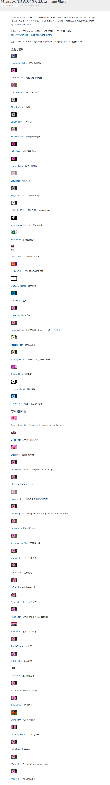

# 驗證碼

# 驗證碼(CAPTCHA)處理

## 想法
1. 人工处理（line API 傳送 驗證碼）
2. OCR 處理 (opencv ,tesseract )
3. 机器学习

---

## 參考資料 

1. [Google釋出新版reCAPTCHA機制，只要點「我不是機器人」！](https://www.ithome.com.tw/news/92757)
2. [僅需15分鐘，使用OpenCV+Keras輕鬆破解驗證碼](https://itw01.com/24OMEZO.html)


[實作基於CNN的台鐵訂票驗證碼辨識以及驗證性高的訓練集產生器](https://github.com/JasonLiTW/simple-railway-captcha-solver)
https://www.ptt.cc/bbs/Python/M.1514130793.A.2E1.html


---
# opencv
[OpenCV学习笔记](https://blog.csdn.net/column/details/opencv-manual.html?&page=3)

## gradle jar

```
    // ocr
    compile group: 'net.sourceforge.tess4j', name: 'tess4j', version: '3.4.0'
    compile group: 'org.ghost4j', name: 'ghost4j', version: '1.0.1'

    // 滤镜
    compile group: 'com.jhlabs', name: 'filters', version: '2.0.235-1'

    // Java图片处理的类库
    compile group: 'net.coobird', name: 'thumbnailator', version: '0.4.8'

    // Java图片处理的类库
    compile group: 'org.gephi', name: 'gephi-toolkit', version: '0.9.2'

    // Java图片处理的类库：SimpleImage
    compile group: 'com.alibaba', name: 'simpleimage', version: '1.2.3'
```

## [java方面图形/图像处理](https://blog.csdn.net/u011596455/article/details/54099372)


## [强大的Java图像滤镜特效类库Java Image Filters](http://www.jhlabs.com/ip/filters/index.html)





