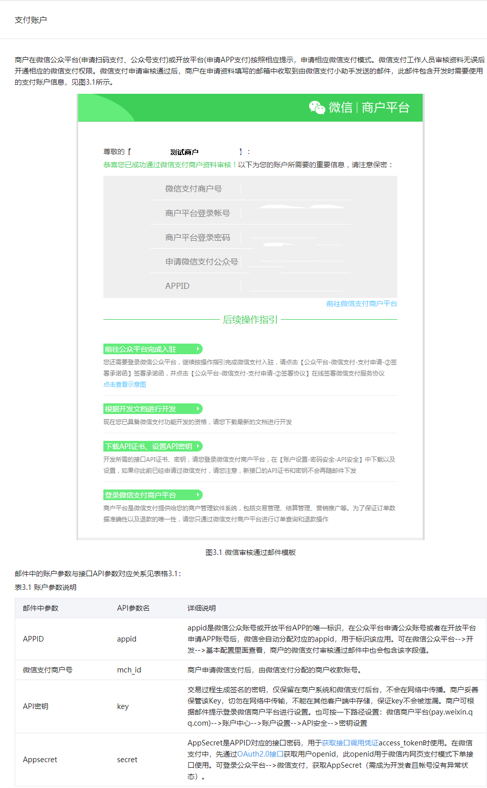
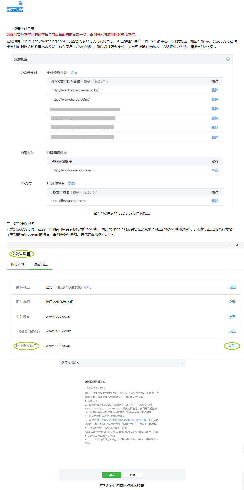
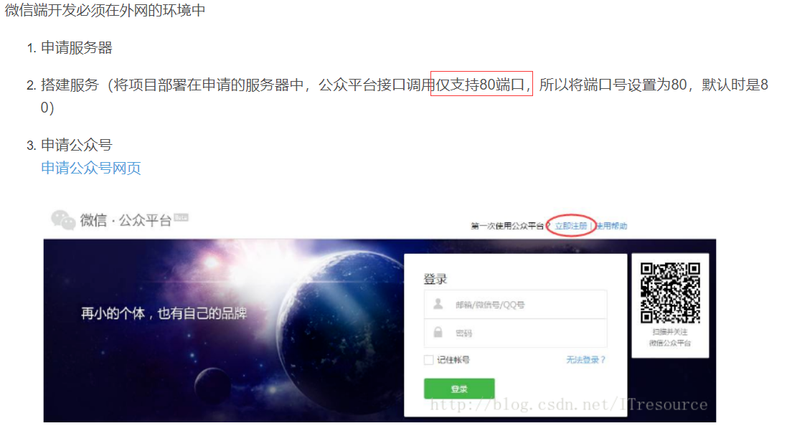
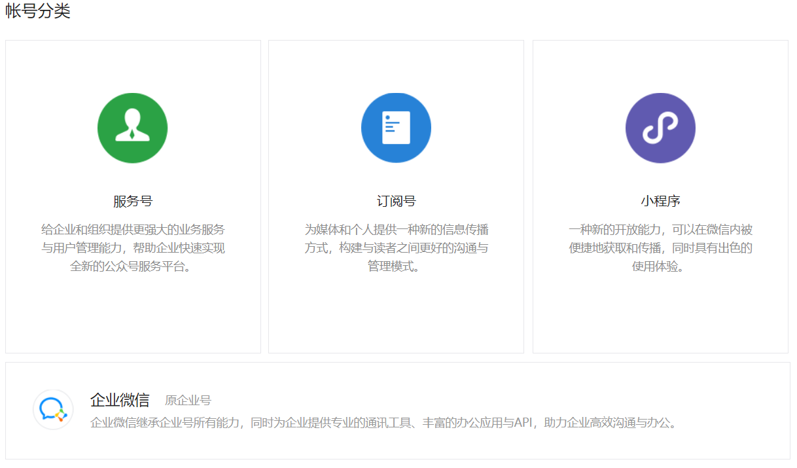
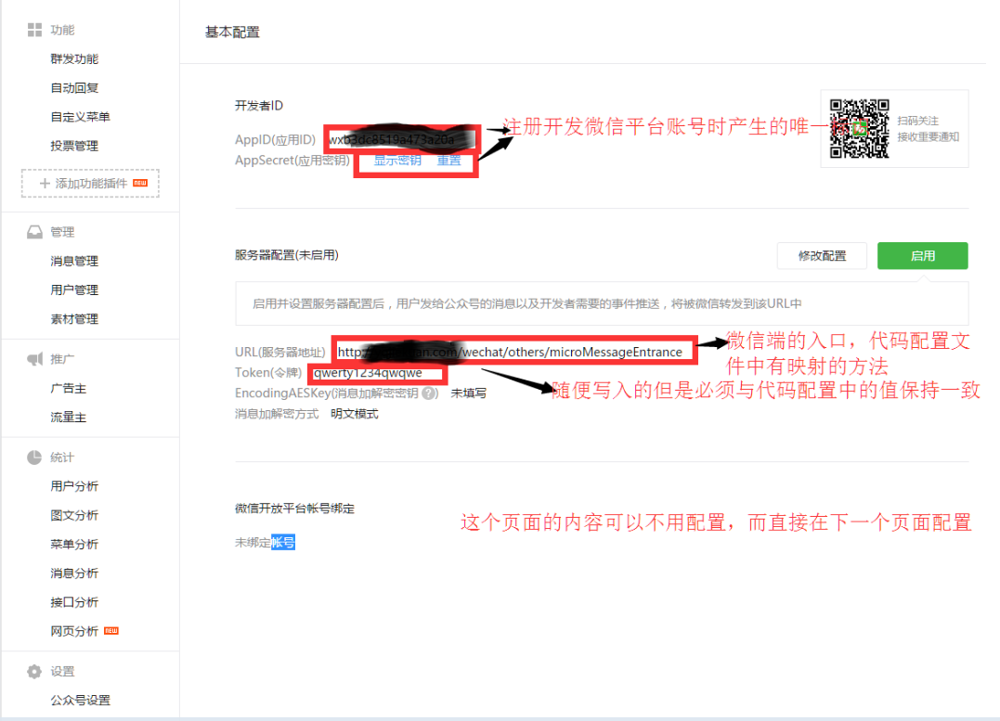
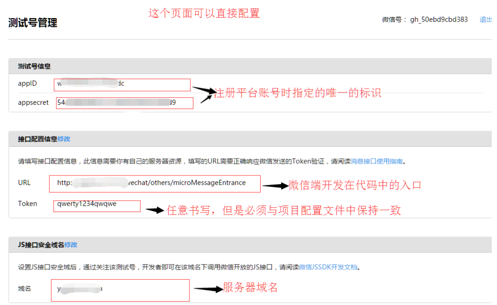
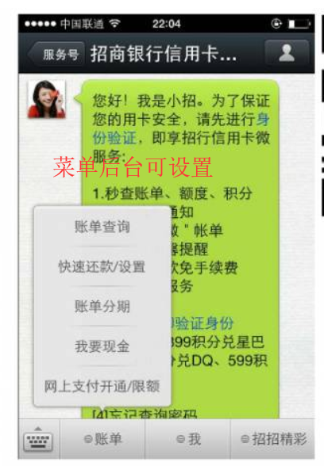
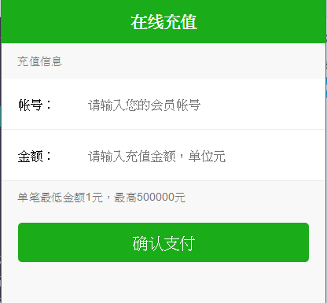

# 微信公众号
1. 订阅号
2. 服务号
3. 企业号


[微信网页授权](https://mp.weixin.qq.com/wiki?t=resource/res_main&id=mp1421140842)
> 如果用户在微信客户端中访问第三方网页，公众号可以通过微信网页授权机制，来获取用户基本信息，进而实现业务逻辑。


## 微信网页开发
[微信网页开发](https://mp.weixin.qq.com/wiki?t=resource/res_main&id=mp1421140842)


## 鉴权 "  申请的授权域名 => mypay.mypay1.com   "

### 配置以后此域名下面的页面，都可以进行OAuth2.0鉴权
1. http://mypay.mypay1.com/music.html
2. http://mypay.mypay1.com/login.html 


### 无法进行OAuth2.0鉴权，不行的域名
1. http://pay.mypay1.com 
2. http://music.mypay1.com
3. http://mypay1.com 


## 授权scope
1. snsapi_base (V)，关注后用户无感觉自动授权
2. snsapi_userinfo


## 支付JSAPI-开发步骤

[支付JSAPI-开发步骤](https://pay.weixin.qq.com/wiki/doc/api/jsapi.php?chapter=7_3)


## 开发流程

[开发流程](https://mp.weixin.qq.com/wiki?t=resource/res_main&id=mp1421140842)

1. 用户同意授权，获取code
2. 通过code换取网页授权access_token
3. 拉取用户信息(需scope为 snsapi_userinfo)
4. [统一下单](https://pay.weixin.qq.com/wiki/doc/api/jsapi.php?chapter=9_1)
5. 组成拉起支付的参数
6. [微信内H5调起支付](https://pay.weixin.qq.com/wiki/doc/api/jsapi.php?chapter=7_7&index=6)


## 关于特殊场景下的静默授权
1. 上面已经提到，对于以snsapi_base为scope的网页授权，就静默授权的，用户无感知；
2. 对于已关注公众号的用户，如果用户从公众号的会话或者自定义菜单进入本公众号的网页授权页，即使是scope为snsapi_userinfo，也是静默授权，用户无感知。

> 具体而言，网页授权流程分为四步：

1. 引导用户进入授权页面同意授权，获取code
2. 通过code换取网页授权access_token（与基础支持中的access_token不同）
3. 如果需要，开发者可以刷新网页授权access_token，避免过期
4. 通过网页授权access_token和openid获取用户基本信息（支持UnionID机制）


[获取openid](https://pay.weixin.qq.com/wiki/doc/api/jsapi.php?chapter=4_4)


> 微信公众平台：openid是微信用户在公众号appid下的唯一用户标识（appid不同，则获取到的openid就不同），可用于永久标记一个用户，同时也是微信公众号支付的必传参数。





## 公众号支付
> 公众号支付是用户在微信中打开商户的H5页面，商户在H5页面通过调用微信支付提供的JSAPI接口调起微信支付模块完成支付。应用场景有：
1. 用户在微信公众账号内进入商家公众号，打开某个主页面，完成支付
2. 用户的好友在朋友圈、聊天窗口等分享商家页面连接，用户点击链接打开商家页面，完成支付
3. 将商户页面转换成二维码，用户扫描二维码后在微信浏览器中打开页面后完成支付


## 微信web开发者工具
[微信web开发者工具](https://mp.weixin.qq.com/wiki?t=resource/res_main&id=mp1455784140)


## 微信公众平台开发-入门指引
[微信公众平台开发-入门指引](https://mp.weixin.qq.com/wiki?t=resource/res_main&id=mp1445241432)








# 开发流程

## 准备2条报备域名
1. www.公众号报备域名(cname 客户前台)
2. pay.公众号报备域名(cname RD)

---


1. 使用微信打开(客户前台主机)，www.公众号报备域名/wap/weixinOfficialAccount.jsp ，送单后到RD的“redirect742.jsp”



2. redirect742.jsp产生订单orderNo
3. 用appid(post to 微信)( "wxgetcode/" + orderNo + ".zv")，订单号藏在URL，所以需要用 servlet接，开始进行Oauth认证
4. Oauth认证，获取code，回来会到sevlet，servlet把订单号拆出来，导向WxGetCode2.jsp页面处理

```
<servlet>
    <servlet-name>WxGetCodeController</servlet-name>
    <servlet-class>com.XXXXXX.WxGetCodeController</servlet-class>
</servlet>
<servlet-mapping>
    <servlet-name>WxGetCodeController</servlet-name>
    <url-pattern>/wxgetcode/*</url-pattern>
</servlet-mapping>
```

5. WxGetCode2.jsp页面可以拿到code，使用code获取accessToken
6. 使用accessToken获取openid
7. 使用openid开始产生微信订单(接收参数)，sendredirect到客户前台主机(www.公众号报备域名/wap/weixinOfficialAccount.jsp)
8. 在weixinOfficialAccount.jsp页面使用"微信JSSDK"拉起"微信支付"
9. 支付完成后，页面reflash，可以再重新支付


