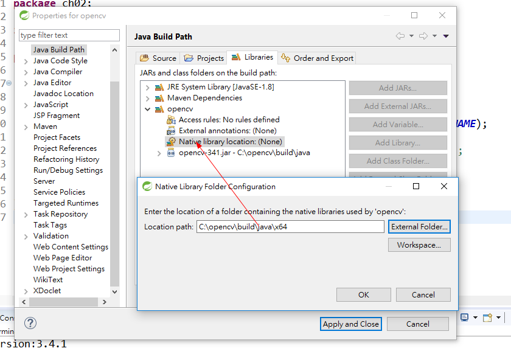

# [OpenCV-for-Java](https://github.com/JavaOpencvTensorflow/OpenCV-for-Java)

[opencv中文网](http://www.opencv.org.cn/)

[opencv java doc](https://docs.opencv.org/3.4.1/javadoc/index.html)

## 下载opencv 执行解压缩放到 C:\opencv
[download opencv-3.4.1-vc14_vc15.exe](https://sourceforge.net/projects/opencvlibrary/)

### opencv_java341 path（把opencv载入eclipse）

## 资料

[OpenCV Java Tutorials](http://opencv-java-tutorials.readthedocs.io/en/latest/index.html)

[OpenCV数据结构之Mat](https://www.chengxulvtu.com/2014/03/25/opencv-mat.html)

