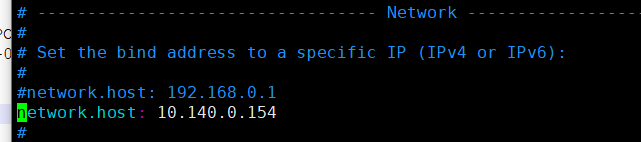

# ELK 

https://github.com/vy/log4j2-logstash-layout


```
GCP 6.2 ELK
IP:35.194.223.64
ID:zonpay
Password : GCP KEY
ELK相關程序目錄
cd /etc/kibana/
cd /etc/logstash/
cd /etc/elasticsearch/
---------------------------------
啟動 ELK
systemctl start elasticsearch
systemctl start logstash(已停止)，使用firebean直接送到ela
systemctl start kibana
systemctl start nginx
---------------------------------
關閉 ELK
systemctl stop elasticsearch
systemctl stop logstash
systemctl stop kibana
systemctl stop nginx
---------------------------------
自訂 serverLog4j.conf 啟動
systemctl start elasticsearch
/usr/share/logstash/bin/logstash -f /etc/logstash/conf.d/serverLog4j.conf --path.logs /var/log/logstash
systemctl start kibana
systemctl start nginx
---------------------------------
關閉自訂 serverLog4j.conf  logstash
systemctl stop elasticsearch
ps aux | grep logstash
kill -9 ????
systemctl stop kibana
systemctl stop nginx
```


## 注意 network 会挡住



service nginx restart
systemctl status nginx


systemctl restart elasticsearch
systemctl restart kibana
systemctl restart nginx


systemctl stop firewalld
systemctl disable firewalld.service

## logstash-*
> 像logstash-*这样命名的indices会应用默认的logstash index模板

```
用 curl 查詢 Elasticsearch 的 Indices Name：

curl "http://localhost:9200/_cat/indices?v&h=i"


删除Indices
curl -XDELETE "localhost:9200/zonpay-2018.01*"
curl -XDELETE "localhost:9200/zonpay-*"


删除30天前资料
curl -XDELETE "localhost:9200/zonpay-`date -d '-30 days' '+%Y%m%d'`*" >> /var/log/elk-deleteLog.log 2>&1

写到cron自动删除
/opt/elkCronJob/deleteLog.sh >> /var/log/elk-deleteLog.log 2>&1


/etc/init.d/cron restart


查看当前线程组状态
curl -XGET 'http://localhost:9200/_nodes/stats?pretty'  
```

bin/logstash -f json.conf