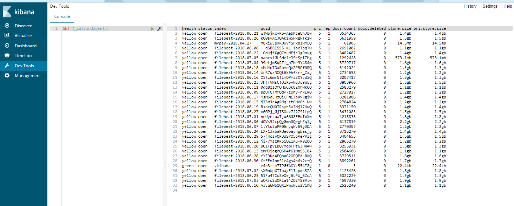

# kibana Dev Tools

## indices

[indices api](https://www.elastic.co/guide/en/elasticsearch/reference/current/indices.html)

### 列出elk目前有哪些indices
```
GET /_cat/indices?v
```


```
GET /_cat/indices/new-*?v&s=index
```


### Delete index

```
找出"new-2018.04.27"资料
GET new-2018.04.27/
删除"new-2018.04.27"资料
DELETE new-2018.04.27/

找出“new-*”资料
GET new-*
删除“new-*”资料
DELETE new-*

找出“zonpay-*”资料
GET zonpay-*
删除“zonpay-*”资料
DELETE zonpay-*
```
## 最后

