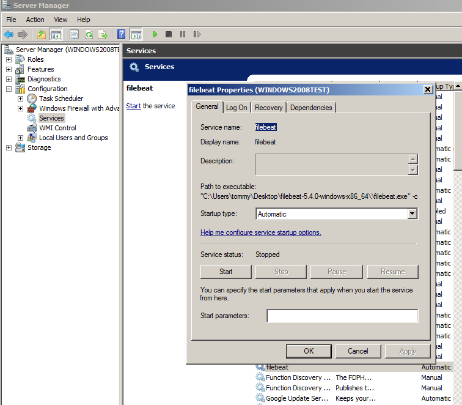

# filebeat


[Filebeat的架构分析、配置解释与示例](https://blog.csdn.net/Gamer_gyt/article/details/52688636)


[Filebeat安装部署及配置详解](https://cloud.tencent.com/developer/article/1006051)


[使用 Filebeat 收集日志](https://blog.csdn.net/github_39939645/article/details/78896737)

[ELK + Kafka + Filebeat学习](https://blog.csdn.net/Remoa_Dengqinyi/article/details/77902391)

[ELK+Filebeat+Kafka+ZooKeeper 构建海量日志分析平台](http://blog.51cto.com/tchuairen/1861167)


## windows系统安装运行filebeat

下载安装包 下载地址：https://www.elastic.co/downloads/beats/filebeat
解压到指定目录
打开解压后的目录，打开filebeat.yml进行配置。

①：配置 Filebeat prospectors->path 这里的路径是所要收集日志的路径 
②：配置 enabled: true 这个配置很重要，只有配置为true之后配置才可生效，否则不起作用。 
③：配置Outputs ，这里的Outputs有elasticsearch，logstash。按照配置文件下面的示例配置即可。

打开刚才解压目录 按住ctrl+shift 并同时鼠标右键打开cmd窗口执行命令 
.\filebeat -e -c filebeat.yml 就可以启动filebeat


## fileBean windows 2008 配置介绍


```
首先，在Windows的powershell，將filebeat安裝成服務。 第一次使用的時候，會有簽章問題而無法執行，所以先在powershell中，不限制
Set-ExecutionPolicy	Unrestricted 
[Y]


第二，執行安裝filebeat服務的ps，一樣在powershll中執行
PS > cd 'C:\Program Files\Filebeat'
PS C:\Program Files\Filebeat> .\install-service-filebeat.ps1
[R]

為了安全，可以再把未簽章執行限制放回去
Set-ExecutionPolicy Restricted
[Y]

----------------------------------

如果上面报错，则执行下面这个

PowerShell -ExecutionPolicy Bypass -File C:\filebeat\install-service-filebeat.ps1

```




# filebeat.yml 设定档
```

filebeat.prospectors:
- input_type: log
  paths:
    - c:\Tomcat 8.5\logs\callbackLogStash\*
    - c:\Tomcat 8.5\logs\redirectLogStash\*

processors:
 - decode_json_fields:
     fields: ["mdc", "ndc", "exception","exception_class","exception_message","stacktrace","line_number","class","@version","source_host","ndc","message","thread_name","@timestamp","level","file","method","logger_name", ]
     process_array: false
     max_depth: 10
     target: "filebeat"
     overwrite_keys: false

output.elasticsearch:
  hosts: ["10.140.0.154:9200"]

logging.level: debug

logging.to_files: true
logging.files:
rotateeverybytes: 10485760 # = 10MB
keepfiles: 7
```


curl -XPOST http://localhost:9200/zonpay-*/_search?pretty=true


