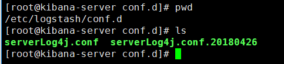
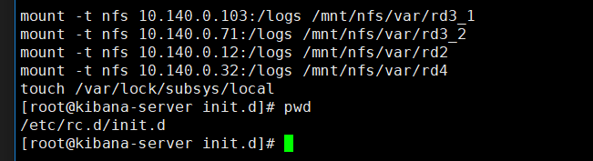
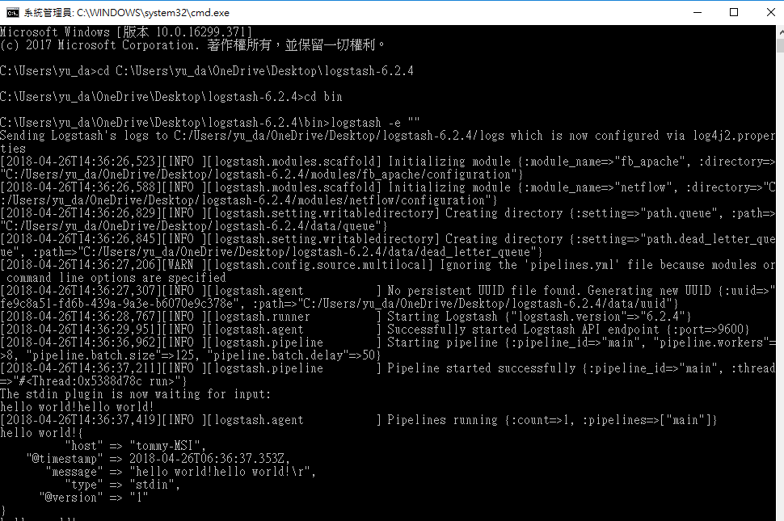

# logstash测试


## GCP ELK(6.2.3) server


检查 serverLog4j.conf
> /usr/share/logstash/bin/logstash  -f /etc/logstash/conf.d/serverLog4j.conf --config.test_and_exit

> ps aux | grep logstash

## 启动 logstash
> /usr/share/logstash/bin/logstash -f /etc/logstash/conf.d/serverLog4j.conf --path.logs /var/log/logstash/ > /var/log/logstash/111.log &








mount -t nfs 10.140.0.12:/logs /mnt/nfs/var/mypay1-rd2
mount -t nfs 10.140.0.13:/logs /mnt/nfs/var/mypay1-rd3
mount -t nfs 10.140.0.103:/logs /mnt/nfs/var/mypay-rd3-1
mount -t nfs 10.140.0.71:/logs /mnt/nfs/var/mypay-rd3-2
mount -t nfs 10.140.0.32:/logs /mnt/nfs/var/mypay-rd4
mount -t nfs 10.140.0.248:/logs /mnt/nfs/var/mypay-rd7
mount -t nfs 10.140.0.249:/logs /mnt/nfs/var/mypay-rd8

移出
umount /mnt/nfs/var/rd2


> /usr/share/logstash/bin/logstash -f /etc/logstash/conf.d/logstash.conf --path.logs /var/log/logstash/ > /var/log/logstash/logstash.log &


/usr/share/logstash/bin/logstash -f /etc/logstash/conf.d/logstash.conf  --config.test_and_exit
/usr/share/logstash/bin/logstash -f /etc/logstash/conf.d/logstash2.conf  --config.test_and_exit


/usr/share/logstash/bin/logstash -f /etc/logstash/conf.d/logstash_line.conf  --config.test_and_exit
/usr/share/logstash/bin/logstash -f /etc/logstash/conf.d/logstash_line.conf --path.logs /var/log/logstash/ > /var/log/logstash/logstash.log &


https://logging.apache.org/log4j/2.x/manual/layouts.html


kibana(查订单log,可能会查不到)
http://35.194.223.64/app/kibana
----------------
包含主机
mypay1-rd2
mypay1-rd3
mypay-rd3-1
mypay-rd3-2
mypay-rd4
mypay-rd7
mypay-rd8


---

## 测试LOGSTASH

通过命令行，进入到logstash/bin目录，执行下面的命令：

logstash -e ""



## 测试conf档案
logstash -f setting.conf --config.test_and_exit
logstash -f socketAppender.conf --config.test_and_exit


## 执行logstash使用setting.conf
logstash -f setting.conf
logstash -f socketAppender.conf


```
input {
    file {
        path => "C:/Users/yu_da/OneDrive/Desktop/logstash-6.2.4/test_log_folder/callbackLogStash.log"
		start_position => "beginning"
		type => "zonpay"
		codec => json {
			charset => "UTF-8"
		}

    }
}


output {
    stdout {
        codec => rubydebug
    }
}


```


