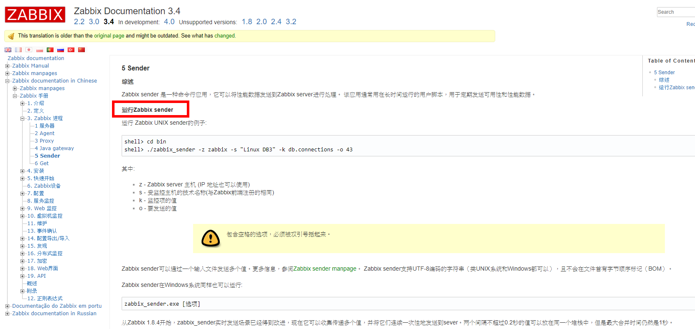
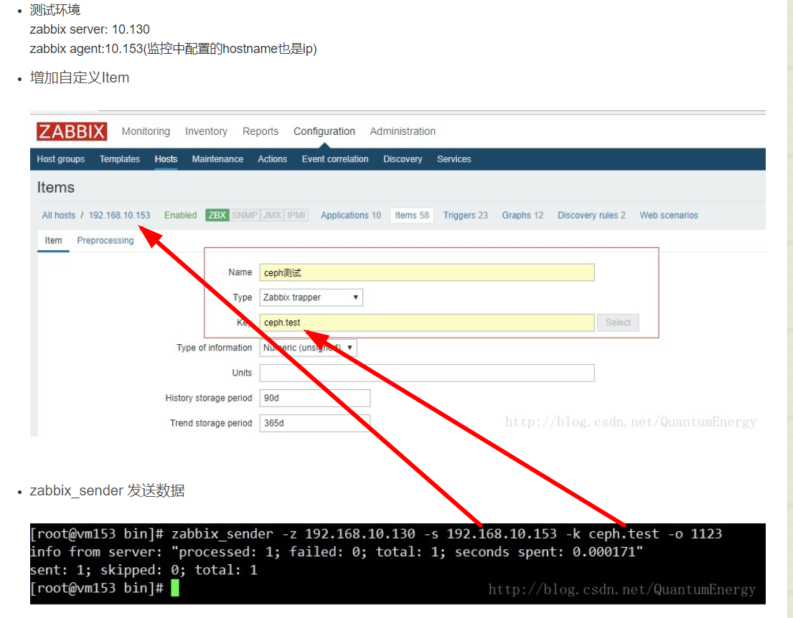
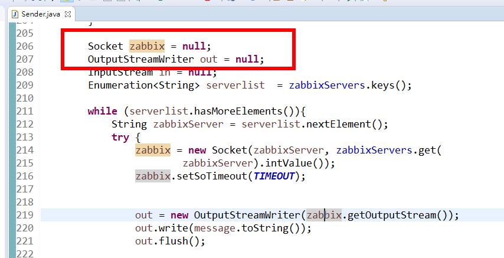

# Zabbix sender , zabbix trapper(主动发送数据给zabbix-server)

 


## zabbix-sender主动发送数据给zabbix-server



## orabbix 利用此方法来拿到oracle数据 



[orabbix source code](https://github.com/sboschman/orabbix)
[ZABBIX_SENDER](https://www.zabbix.com/documentation/3.4/manpages/zabbix_sender)


[java zabbix-sender](https://github.com/hengyunabc/zabbix-sender)
```
String host = "127.0.0.1";
int port = 10051;
ZabbixSender zabbixSender = new ZabbixSender(host, port);

DataObject dataObject = new DataObject();
dataObject.setHost("172.17.42.1");
dataObject.setKey("test_item");
dataObject.setValue("10");
// TimeUnit is SECONDS.
dataObject.setClock(System.currentTimeMillis()/1000);
SenderResult result = zabbixSender.send(dataObject);

System.out.println("result:" + result);
if (result.success()) {
    System.out.println("send success.");
} else {
    System.err.println("sned fail!");
}
```
