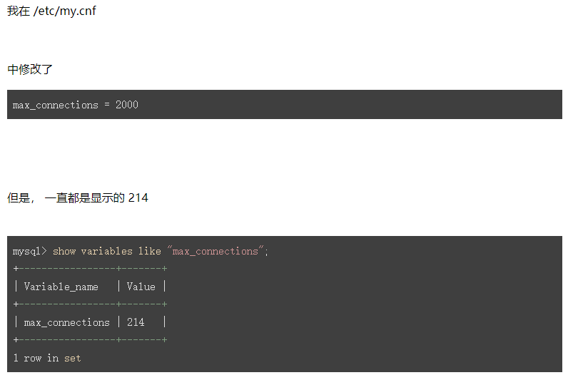
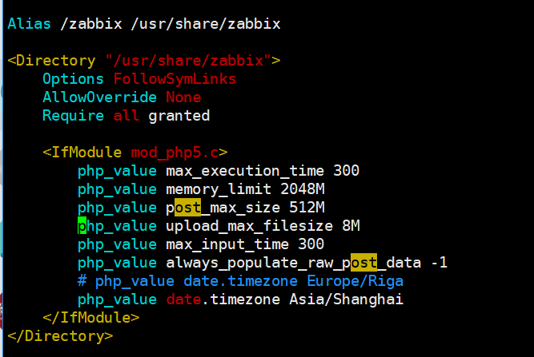

# add host

*************
mysql 无法设定连线超过214




目前这样处理
mysql> set global max_connections = 1000;


修改php，资料才会出现


**********************


./su.sh
cp /etc/zabbix/zabbix_agentd.conf /etc/zabbix/zabbix_agentd.conf.20180731
sed -i 's/Server=zabbix.mypay1.com/Server=zabbix.mypay1.com,10.140.0.23/g' /etc/zabbix/zabbix_agentd.conf
cat /etc/zabbix/zabbix_agentd.conf | grep mypay


systemctl restart zabbix-agent.service
systemctl status zabbix-agent.service


cp /etc/systemd/system/tomcat.service /etc/systemd/system/tomcat.service.20180731
sed -i "s/35.189.161.7/10.140.0.129/g" /etc/systemd/system/tomcat.service
cat /etc/systemd/system/tomcat.service | grep 10.140.0.129


systemctl disable tomcat.service
systemctl enable tomcat.service
systemctl restart tomcat.service
systemctl status tomcat.service


041				10.140.15.228
074				10.140.0.101
114             10.140.0.200
161             10.140.1.110
196             10.140.1.179
211             10.140.1.208
vim /etc/systemd/system/tomcat.service

systemctl disable tomcat.service
systemctl enable tomcat.service
systemctl daemon-reload
systemctl restart tomcat.service
systemctl status tomcat.service


systemctl restart zabbix-agent.service 
systemctl status zabbix-agent.service 


## windows command

-- Administractor

ipconfig

10.140.0.159

10.140.1.254

10.140.15.202


10.140.2.30

Server=zabbix.mypay1.com,10.140.0.23

------------------------------

net stop "Zabbix Agent"

net start "Zabbix Agent"

net stop Tomcat8

net start Tomcat8


http://1007.xc7001.com/cooejw/admin/index.jsp


zonpay
mypay@zonvan

http://localhost/manager

http://th33.99399ht.com/admin/index.jsp


{$CONTEXT}

{$HOST_DOMAIN_NAME}


## linux command

```
./su.sh
cp /etc/zabbix/zabbix_agentd.conf /etc/zabbix/zabbix_agentd.conf.20180810
sed -i 's/Server=zabbix.mypay1.com/Server=zabbix.mypay1.com,10.140.0.23/g' /etc/zabbix/zabbix_agentd.conf
cat /etc/zabbix/zabbix_agentd.conf | grep mypay

systemctl restart zabbix-agent.service
systemctl status zabbix-agent.service

cp /etc/systemd/system/tomcat.service /etc/systemd/system/tomcat.service.20180810
sed -i "s/35.229.223.31/10.140.0.242/g" /etc/systemd/system/tomcat.service
cat /etc/systemd/system/tomcat.service | grep 10.140.0.242

systemctl disable tomcat.service
systemctl enable tomcat.service
systemctl restart tomcat.service
systemctl status tomcat.service
```


## 处理zabbix

systemctl restart zabbix-server.service 
systemctl status zabbix-server.service 


