# GCP 安装 zabbix

[zabbix](https://www.zabbix.com/manuals)

## GCP创建server


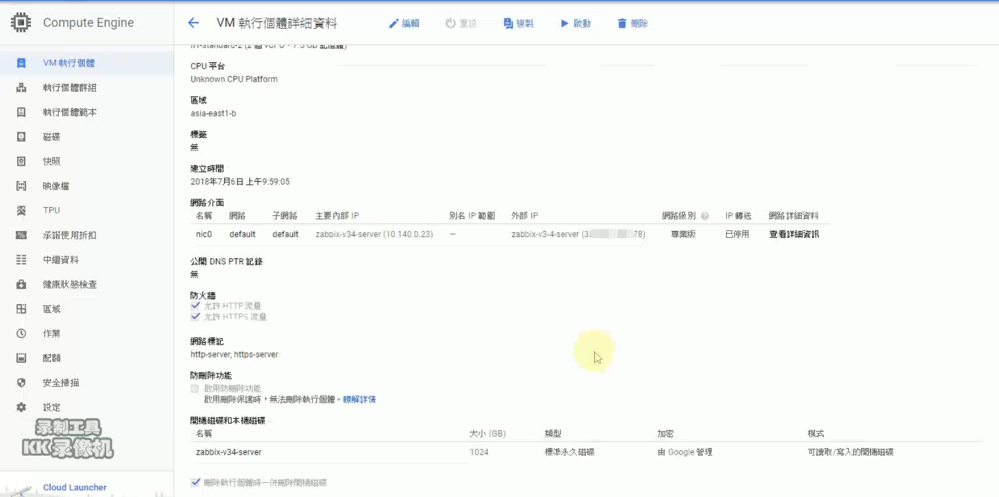


## 检查java版本


## 检查SELinux


## 检查firewalld


## 安裝 MySQL Repository
```
rpm -Uvh http://dev.mysql.com/get/mysql-community-release-el7-5.noarch.rpm
```
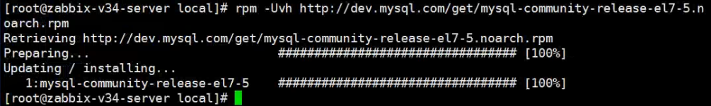


## 安裝 MySQL Server, MySQL client 已經包括在 server 套件內
```
# yum install mysql-community-server
```


## 開機自動啟動 MySQL
```
# /usr/bin/systemctl enable mysqld
```

## 啟動 MySQL
```
# /usr/bin/systemctl start mysqld
```


```
systemctl status mysqld.service
```


## MySQL 預設為空密碼, 執行以下指令修改
```
# /usr/bin/mysql_secure_installation

# mysql -uroot -p

GRANT ALL PRIVILEGES ON *.* TO 'root'@'%' IDENTIFIED BY 'root@zonvan';
flush privileges;

```
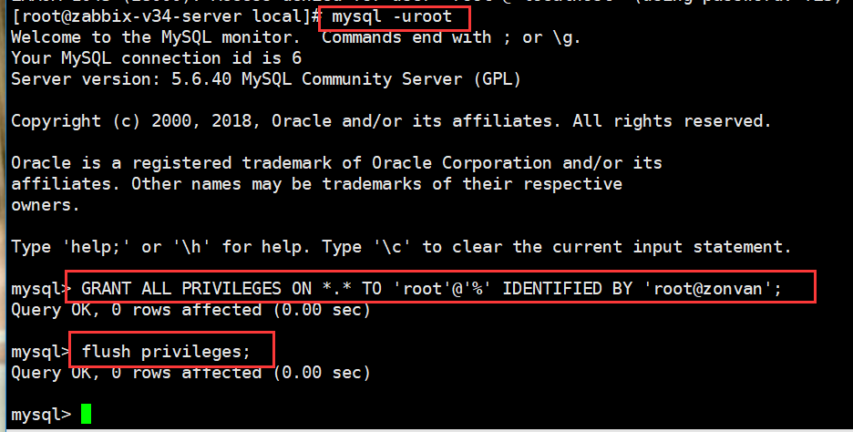


---

## 安装zabbix源码库配置部署包
```
RHEL 7:

rpm -ivh http://repo.zabbix.com/zabbix/3.4/rhel/7/x86_64/zabbix-release-3.4-2.el7.noarch.rpm


yum-config-manager --enable rhel-7-server-optional-rpms

```


## Server/proxy/frontend installation
```
yum install zabbix-server-mysql
```


## Server/proxy/frontend installation
```
yum install zabbix-proxy-mysql
```


## install Zabbix frontend
```
yum install zabbix-web-mysql
```


## Create the database using the provided instructions for MySQL
```
shell> mysql -uroot -p
mysql> create database zabbix character set utf8 collate utf8_bin;
mysql> grant all privileges on zabbix.* to zabbix@localhost identified by 'zabbix';
mysql> GRANT ALL PRIVILEGES ON *.* TO 'zabbix'@'%' IDENTIFIED BY 'zabbix';
flush privileges;

mysql> quit;
```
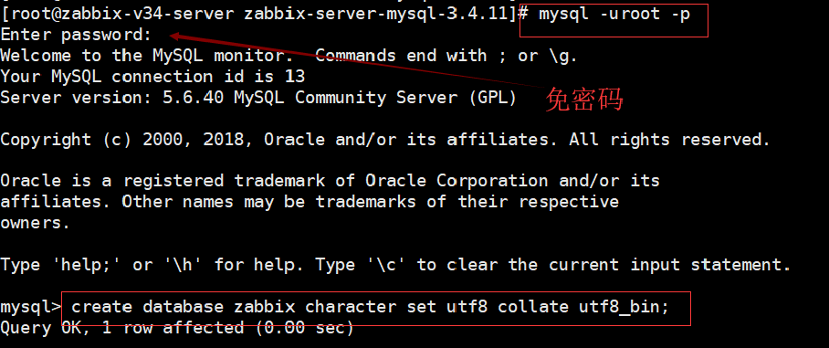
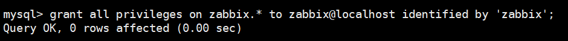
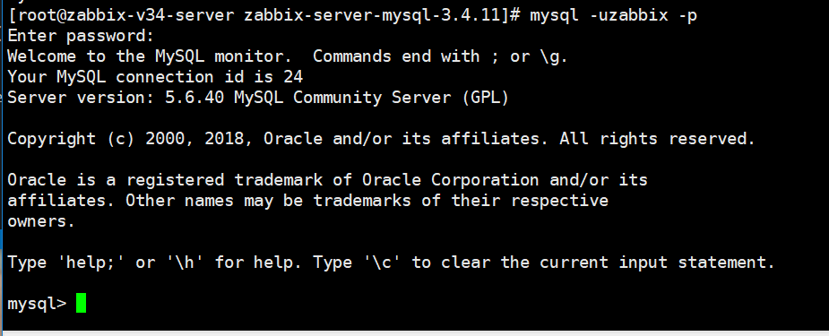


## Importing data
```
cd /usr/share/doc/zabbix-server-mysql-3.4.11
```

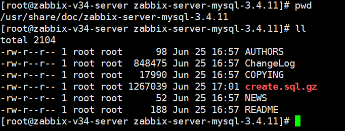

```
zcat /usr/share/doc/zabbix-server-mysql*/create.sql.gz | mysql -uzabbix -p zabbix
```

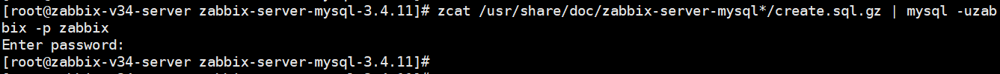


## zabbix server conf
```
vim /etc/zabbix/zabbix_server.conf
```

## 启动zabbix server
```
systemctl status zabbix-server.service
```
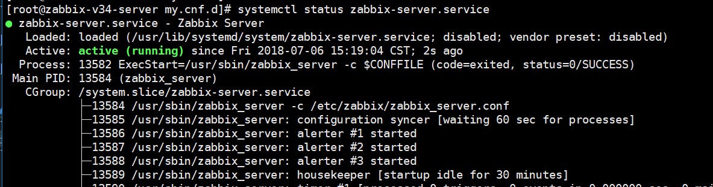


## 变更php的timezone
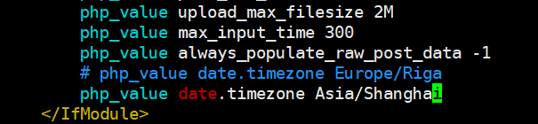


## 重新启动httpd
```
systemctl restart httpd.service
```
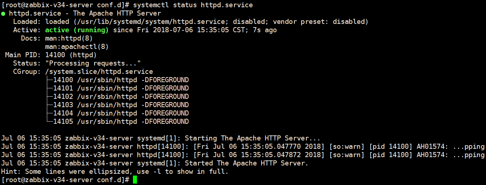


## zabbix-agent installation
```
yum install zabbix-agent
```
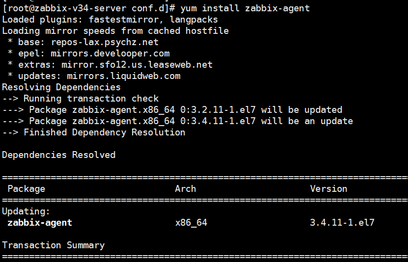


