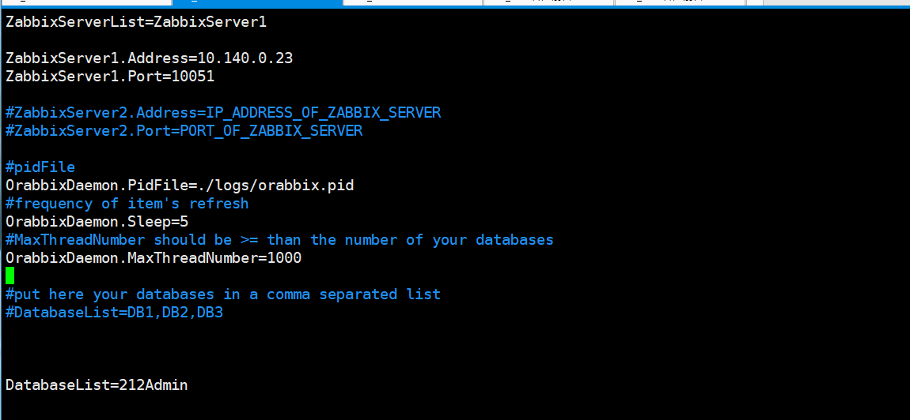

# GCP 安装 zabbix v3.4

[zabbix](https://www.zabbix.com/manuals)

## GCP创建server


## 检查java版本


## 检查SELinux


## 检查firewalld


## 安裝 MySQL Repository
```
rpm -Uvh http://dev.mysql.com/get/mysql-community-release-el7-5.noarch.rpm
```


## 安裝 MySQL Server, MySQL client 已經包括在 server 套件內
```
# yum install mysql-community-server
```


## 開機自動啟動 MySQL
```
# /usr/bin/systemctl enable mysqld
```

## 啟動 MySQL
```
# /usr/bin/systemctl start mysqld
```


```
systemctl status mysqld.service
```


## MySQL 預設為空密碼, 執行以下指令修改
```
# /usr/bin/mysql_secure_installation

# mysql -uroot -p

GRANT ALL PRIVILEGES ON *.* TO 'root'@'%' IDENTIFIED BY 'root@zonvan';
flush privileges;

```


---

## 安装zabbix源码库配置部署包
```
RHEL 7:

rpm -ivh http://repo.zabbix.com/zabbix/3.4/rhel/7/x86_64/zabbix-release-3.4-2.el7.noarch.rpm


yum-config-manager --enable rhel-7-server-optional-rpms

```


## Server/proxy/frontend installation
```
yum install zabbix-server-mysql
```


## Server/proxy/frontend installation
```
yum install zabbix-proxy-mysql
```


## install Zabbix frontend
```
yum install zabbix-web-mysql
```


## Create the database using the provided instructions for MySQL
```
shell> mysql -uroot -p
mysql> create database zabbix character set utf8 collate utf8_bin;
mysql> grant all privileges on zabbix.* to 'zabbix'@'localhost' identified by 'zabbix';
mysql> GRANT ALL PRIVILEGES ON *.* TO 'zabbix'@'%' IDENTIFIED BY 'zabbix';
mysql> flush privileges;
mysql> quit;
```


## Importing data
```
cd /usr/share/doc/zabbix-server-mysql-3.4.11
```


```
zcat /usr/share/doc/zabbix-server-mysql*/create.sql.gz | mysql -uzabbix -p zabbix
```


## zabbix server conf
```
vim /etc/zabbix/zabbix_server.conf
```

## 启动zabbix server
```
systemctl status zabbix-server.service
```


## 变更php的timezone


## 重新启动httpd
```
systemctl restart httpd.service
```


## zabbix-agent installation
```
yum install zabbix-agent
```


## 准备开始

http://35.236.140.178/zabbix/setup.php


## zabbix_agentd.conf设定


## 安裝 zabbix-java-gateway
```
# yum install -y zabbix-java-gateway
```


> rpm -ql zabbix-java-gateway


systemctl status zabbix-java-gateway.service
systemctl enable zabbix-java-gateway.service


## 配置/etc/zabbix/zabbix_server.conf文件
```
# vim /etc/zabbix/zabbix_server.conf
### Option: JavaGateway
#       IP address (or hostname) of Zabbix Java gateway.
#       Only required if Java pollers are started.
#
# Mandatory: no
# Default:
JavaGateway=127.0.0.1

### Option: JavaGatewayPort
#       Port that Zabbix Java gateway listens on.
#
# Mandatory: no
# Range: 1024-32767
# Default:
JavaGatewayPort=10052

### Option: StartJavaPollers
#       Number of pre-forked instances of Java pollers.
#
# Mandatory: no
# Range: 0-1000
# Default:
StartJavaPollers=5	
```

## 配置 /etc/zabbix/zabbix_java_gateway.conf 文件
```
# vim /etc/zabbix/zabbix_java_gateway.conf
# This is a configuration file for Zabbix Java Gateway.
# It is sourced by startup.sh and shutdown.sh scripts.

### Option: zabbix.listenIP
#	IP address to listen on.
#
# Mandatory: no
# Default:
LISTEN_IP="0.0.0.0"

### Option: zabbix.listenPort
#	Port to listen on.
#
# Mandatory: no
# Range: 1024-32767
# Default:
LISTEN_PORT=10052

### Option: zabbix.pidFile
#	Name of PID file.
#	If omitted, Zabbix Java Gateway is started as a console application.
#
# Mandatory: no
# Default:
# PID_FILE=

PID_FILE="/var/run/zabbix/zabbix_java.pid"

### Option: zabbix.startPollers
#	Number of worker threads to start.
#
# Mandatory: no
# Range: 1-1000
# Default:
START_POLLERS=5
```

## 启动 zabbix-java-gateway
```
# systemctl enable zabbix-java-gateway.service
ln -s '/usr/lib/systemd/system/zabbix-java-gateway.service' '/etc/systemd/system/multi-user.target.wants/zabbix-java-gateway.service'

# systemctl start zabbix-java-gateway.service

systemctl restart zabbix-server
```

# 客戶212(暫停使用)  mypay-bab  主机测试


## windows

### 212Admin


### 更新zabbix agent conf


### 更新tomcat jmx


### restart zabbix agent


### restart tomcat

## linux

### 212Order


### 更新zabbix agent conf


```
vim /etc/zabbix/zabbix_agentd.conf
```


### 更新tomcat jmx


```
vim /etc/systemd/system/tomcat.service
```


```
systemctl disable tomcat.service
systemctl enable tomcat.service
systemctl restart tomcat.service
systemctl status tomcat.service
```


## 新增 Media types

```
cd /usr/lib/zabbix/alertscripts
```


## 新增 Action


## orabbix
```
cd /opt
mkdir orabbix
rz orabbix-1.2.3.zip
unzip orabbix-1.2.3.zip
chmod 777 -R /opt/orabbix
cd conf
```


### 复制orabbix启动文件到etc目录下
```
cp /opt/orabbix/init.d/orabbix /etc/init.d/orabbix


chkconfig --add orabbix
chkconfig orabbix on
systemctl enable orabbix.service
/etc/init.d/orabbix start
```


### orabbix conf

```
vim /opt/orabbix/conf/config.props
```


## 中文乱码
下载 simkai.ttf


```
vim /usr/share/zabbix/include/defines.inc.php

graphfont 换成 simkai
```