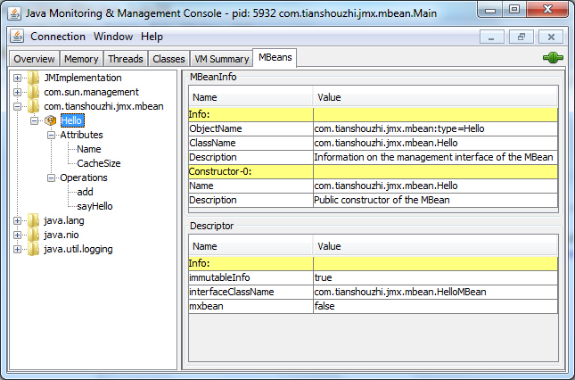

# Zabbix.JMX


[Zabbix 配置 JMX 监控](https://jaminzhang.github.io/monitoring/Zabbix-config-JMX/)


[Manage Tomcat with JMX remote Ant Tasks](http://tomcat.apache.org/tomcat-8.5-doc/monitoring.html#Introduction)


## [Java MBean 教学](http://www.tianshouzhi.com/api/tutorials/jmx/34)

```
MBean接口

package com.tianshouzhi.jmx.mbean;
 
public interface HelloMBean { 
 
    public void sayHello(); 
    public int add(int x, int y); 
    
    public String getName(); 
     
    public int getCacheSize(); 
    public void setCacheSize(int size); 
}

-------------------------------------------------------------
MBean实现

package com.tianshouzhi.jmx.mbean;
 
public class Hello implements HelloMBean {
    public void sayHello() {
        System.out.println("hello, world");
    }
 
    public int add(int x, int y) {
        return x + y;
    }
 
    public String getName() {
        return this.name;
    }
 
    public int getCacheSize() {
        return this.cacheSize;
    }
 
    public synchronized void setCacheSize(int size) {
        this.cacheSize = size;
        System.out.println("Cache size now " + this.cacheSize);
    }
 
    private final String name = "Reginald";
    private int cacheSize = DEFAULT_CACHE_SIZE;
    private static final int DEFAULT_CACHE_SIZE = 200;
}
-------------------------------------------------------------
创建一个JMX Agent来管理一个资源

package com.tianshouzhi.jmx.mbean;
 
import java.lang.management.*;
import javax.management.*;
 
public class Main {
 
    public static void main(String[] args) throws Exception {
 
        MBeanServer mbs = ManagementFactory.getPlatformMBeanServer();
        ObjectName name = new ObjectName("com.tianshouzhi.jmx.mbean:type=Hello");
        Hello mbean = new Hello();
        mbs.registerMBean(mbean, name);
 
        System.out.println("Waiting forever...");
        Thread.sleep(Long.MAX_VALUE);
    }
}

```


## JMX是Java Management Extensions


1. [开发 Java 管理扩展 (JMX) 管理器并连接到远程 JMX 代理](https://netbeans.org/kb/docs/java/jmx-manager-tutorial_zh_CN.html)
