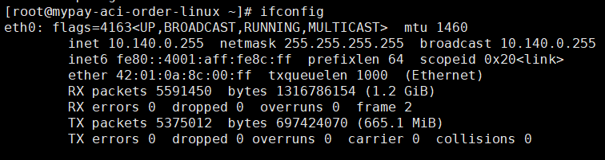
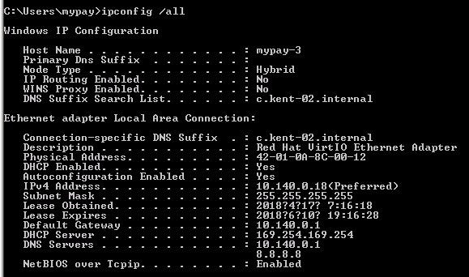
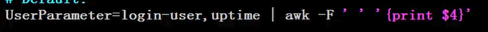

# zabbix-agent

> zabbix_get -s GCP_IP -k "net.if.out[eth0]"


zabbix_get -s 35.194.156.252 -k "proc.num[java.exe,]"
zabbix_get -s 35.194.156.252 -k "proc_info[java.exe,pf,avg]"


windows
zabbix_get -s 35.185.159.211 -k "vfs.fs.size[C:,free]"
zabbix_get -s 35.185.159.211 -k "vfs.fs.size[C:,pfree]"
zabbix_get -s 35.185.159.211 -k "vfs.fs.size[C:,total]"
zabbix_get -s 35.185.159.211 -k "vfs.fs.size[C:,used]"
linux
zabbix_get -s 35.185.159.211 -k "vfs.fs.size[/,free]"
zabbix_get -s 35.185.159.211 -k "vfs.fs.size[/,pfree]"
zabbix_get -s 35.185.159.211 -k "vfs.fs.size[/,total]"
zabbix_get -s 35.185.159.211 -k "vfs.fs.size[/,used]"


zabbix_get -s 35.201.241.7 -k "system.cpu.util[,idle]"

zabbix_get -s 35.201.241.7 -k "vm.memory.size[free]"
zabbix_get -s 35.201.241.7 -k "vm.memory.size[available]"
zabbix_get -s 35.201.162.67 -k "vm.memory.size[free]"
1765400576
zabbix_get -s 35.201.162.67 -k "vm.memory.size[total]"
16105713664
 

{HOST.HOST} 记忆体不足
{MYPAY Linux:vm.memory.size[available].last(0)}<20M
{MYPAY Windows:vm.memory.size[free].last(0)}<536870912
{HOST.HOST} 记忆体小于 512MB

{$HOST_DOMAIN_NAME}

{MYPAY Linux JMX Generic:jmx["java.lang:type=Memory",HeapMemoryUsage.used].last(0)}>({MYPAY Linux JMX Generic:jmx["java.lang:type=Memory",HeapMemoryUsage.max].last(0)}*0.7)


{MYPAY Linux:vm.memory.size[used].last(0)} > ({MYPAY Linux:vm.memory.size[used].last(0)}*0.7 )
{MYPAY Linux:vm.memory.size[used].last(0)} > ({MYPAY Linux:vm.memory.size[used].last(0)}*0.7 )


{MYPAY Windows:vm.memory.size[free].last(0)}<5000


{MYPAY-Windows:vm.memory.free[percent].last()}<5

snmpwalk -v 2c -c public 192.168.0.254 .

snmpwalk -v 2c -c public localhost .

snmpwalk -v 2c -c public localhost 1.3.6.1.2.1.1.1


awesome-chrome-devtools


jmx["Catalina:type=GlobalRequestProcessor,name=https-jsse-nio2-443",bytesReceived]

Catalina:type=GlobalRequestProcessor,name="https-jsse-nio2-443"  bytesReceived


jmx["Catalina:type=GlobalRequestProcessor,name=\"http-nio-80\"",bytesReceived]


jmx["Catalina:type=GlobalRequestProcessor,name=https-jsse-nio2-443",bytesReceived]


jmx["Catalina:type=GlobalRequestProcessor,name=\"https-jsse-nio2-443\"",bytesReceived]


Catalina:type=GlobalRequestProcessor,name="https-jsse-nio2-443"


jmx["Catalina:type=ThreadPool,name=\"https-jsse-nio2-443\"",currentThreadCount]

Catalina:type=ThreadPool,name=


Catalina:type=ThreadPool,name=\"ajp-nio-8009\"


jmx["java.lang:type=GarbageCollector,name=PS MarkSweep",CollectionCount]
     java.lang:type=GarbageCollector,name=PS MarkSweep


jmx["java.lang:type=MemoryPool,name=PS Survivor Space",Usage.committed]
java.lang:type=MemoryPool,name=PS Survivor Space
java.lang:type=MemoryPool,name=PS Eden Space
java.lang:type=MemoryPool,name=Code Cache
jmx["java.lang:type=MemoryPool,name=Code Cache",Usage.committed]
java.lang:type=MemoryPool,name=Compressed Class Space
java.lang:type=MemoryPool,name=Metaspace

{ITEM.DESCRIPTION<1-9>}

{$TOMCAT_HTTP_80_BYTES}
activeSessions

{HOST_DOMAIN_NAME}
{$HOST_DOMAIN_NAME}


http://ht881.ht1397.com/urnf3fh3/admin/index.jsp
{$HOST_CONTEXT}
http://ht881.ht1397.com/urnf3fh3/admin/index.jsp


{$CONTEXT}


{$CONTEXT}
{$HOST_DOMAIN_NAME}


admin-----------------------------------------------
{HOST.HOST}-后台-IP


${HOST.HOST}-IP	 
http://{HOST.IP}/{$CONTEXT}/admin/index.jsp

${HOST.HOST}-DOMAIN_NAME 
http://{$HOST_DOMAIN_NAME}/{$CONTEXT}/admin/index.jsp
	 
	 
	 
	


## windows 测试zabbix

> 进入zabbix目录(cd C:\zabbix)

```
// C槽目前剩下多少空间
zabbix_agentd.exe -t vfs.fs.size[C:,pfree]

zabbix_agentd.exe -t net.if.list

```


## 使用 zabbix_get 在SERVER(192.168.0.30)抓取CLIENT端(GCP)数据

### linux zabbix_get
> zabbix_get -s GCP_IP -k "net.if.out[eth0]"


### windows zabbix_get
zabbix_get -s GCP_IP -k "net.if.out[Red Hat VirtIO Ethernet Adapter]"



## zabbix-agent 自定義用戶訊息
> 加載被監控的主機上面，然後到server端測試可不可以拿到值

格式:UserParameter=[key][value] , key必須在zabbix全局唯一

> 在SERVER端（10.0.0.7）拿取客戶端（10.0.0.8）數據
zabbix_get -s 10.0.0.8 -k login-user


[powershell UnsafeUserParameters](http://my-fish-it.blogspot.com/2017/03/ss-zabbix-32-userparameter-windows.html)

[zabbix Windows-specific item keys](https://www.zabbix.com/documentation/3.4/manual/config/items/itemtypes/zabbix_agent/win_keys)

[zabbix agent所支持的所有KEY](http://blog.51cto.com/skykws8023/1619075)


