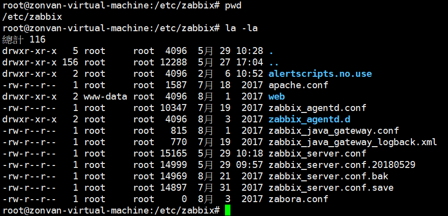

# zabbix 


> 安裝 yum install 參考官方文檔

---

# 自動化的3種方法

1. zabbix-agent主動註冊
2. zabbix-server自動發現
3. [zabbix API](https://www.zabbix.com/documentation/3.4/zh/manual/api/reference/host/create)


---


## Macros（宏）
[Macros supported by location](https://www.zabbix.com/documentation/3.4/manual/appendix/macros/supported_by_location)


[User macros](https://www.zabbix.com/documentation/3.4/manual/config/macros/usermacros)


systemctl status zabbix-server.service





## Zabbix busy XXX
```
Zabbix busy trapper processes, in %                   StartTrappers=5
Zabbix busy poller processes, in %                      StartPollers=5
Zabbix busy ipmi poller processes, in %               StartIPMIPollers=0
Zabbix busy discoverer processes, in %                StartDiscoverers=1
Zabbix busy icmp pinger processes, in %              StartPingers=1
Zabbix busy http poller processes, in %                StartHTTPPollers=1
Zabbix busy proxy poller processes, in %              StartProxyPollers=1
Zabbix busy unreachable poller processes, in %    StartPollersUnreachable=1
Zabbix busy java poller processes, in %                 StartJavaPollers=0
Zabbix busy snmp trapper processes, in %            StartSNMPTrapper=0
Zabbix busy vmware collector processes, in %       StartVMwareCollectors=0

作者：Roles_乐
链接：https://www.jianshu.com/p/077e49960de4
來源：简书
著作权归作者所有。商业转载请联系作者获得授权，非商业转载请注明出处。
```


### ubuntu install zabbix-get command (192.168.0.30)
apt-get install zabbix-get


zabbix_agentd -p   #将客户端自身所有的item-key以及其值都打印出来了

```
zabbix_get -s 127.0.0.1 -p 10050 -k "system.cpu.load[all,avg1]"
   Options
       -s, --host <host name or IP>
              Specify host name or IP address of a host.

       -p, --port <port number>
              Specify  port  number  of  agent running on the host. Default is
              10050.

       -I, --source-address <IP address>
              Specify source IP address.

       -k, --key <item key>
              Specify key of item to retrieve value for.

       -h, --help
              Display this help and exit.

       -V, --version
              Output version information and exit.

EXAMPLES
       zabbix_get -s 127.0.0.1 -p 10050 -k "system.cpu.load[all,avg1]"
```

zabbix_get -s 127.0.0.1 -p 10050 -k "vfs.fs.size[/,pfree]"


