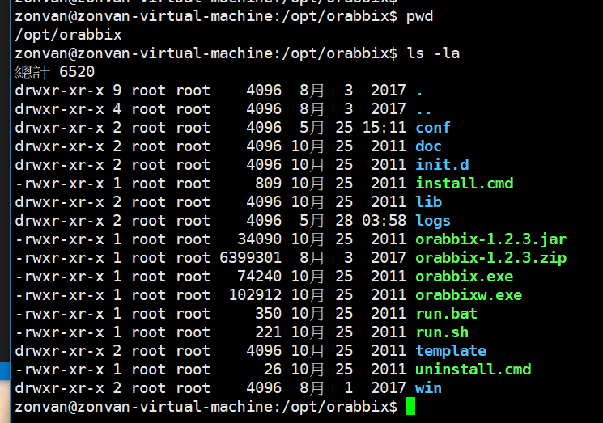

# orabbix 监控 (zabbix-trapper)

[zabbix通过orabbix和自定义脚本监控oracle数据库](https://blog.csdn.net/cuiyan1982/article/details/76889576)

[Zabbix利用Orabbix插件监控Oracle数据库(增强版)--里面有orabbix报错的处理方法](https://blog.csdn.net/cuiyan1982/article/details/77051318)

[orabbix 模板部分监控项取不到数据](https://blog.csdn.net/fengyingyuechou/article/details/75195978)

[zabbix学习笔记：zabbix监控oracle](https://blog.csdn.net/linux_player_c/article/details/53005347)

[客户端自己提交数据给zabbix](http://www.ttlsa.com/zabbix/zabbix-trapper/)

[zabbix trapper方式监控](http://blog.51cto.com/ityunwei2017/1895003)

## zabbix 开启 （orabbix）

conf
    config.props -- 监测数据的设定档
    query.props -- sql (key)

> systemctl restart orabbix.service (重启)

