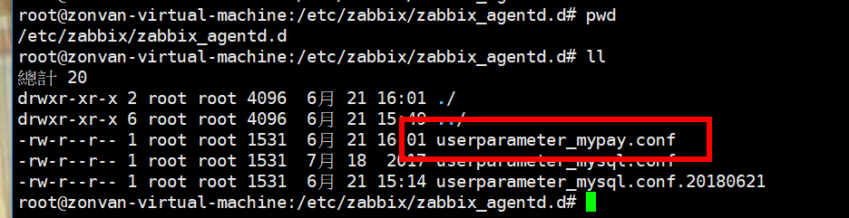

# UserParameter


## 要先安装（yum -y mpstat）


把全部自定义的shell放在 " /etc/zabbix/zabbix_mypay_shell "


UnsafeUserParameters=1



UserParameter=mypay.cpuUsed,/etc/zabbix/zabbix_mypay_shell/cpuUsed.sh
重启" systemctl restart zabbix-agent.service "
测试 zabbix_get -s 127.0.0.1 -k "mypay.cpuUsed" 
测试 zabbix_get -s 127.0.0.1 -k "mypay.diskUsed" 
测试 zabbix_get -s 127.0.0.1 -k "mypay.http_ESTABLISHED" 
测试 zabbix_get -s 127.0.0.1 -k "mypay.http_TIME_WAIT" 


## userparameter_mypay.conf
```
UserParameter=mypay.cpuUsed,/etc/zabbix/zabbix_mypay_shell/cpuUsed.sh
UserParameter=mypay.diskUsed,/etc/zabbix/zabbix_mypay_shell/diskUsed.sh
UserParameter=mypay.http_ESTABLISHED,/etc/zabbix/zabbix_mypay_shell/http_ESTABLISHED.sh
UserParameter=mypay.http_TIME_WAIT,/etc/zabbix/zabbix_mypay_shell/http_TIME_WAIT.sh
```


df -H | grep sda1 | awk '{print $5}' | grep -o '[0-9]\+'

diskUsed=`echo $(df -H | grep sda1 | awk '{print $5}' | grep -o '[0-9]\+')` ;echo $(echo "100.0 - $diskUsed"|bc) ;


## centos 7

```
cpuUsed=`echo $(mpstat -P ALL | grep all | awk '{print $13}')` ;echo $(echo "100.0 - $cpuUsed"|bc) ;


diskUsed=`echo $(df -H | grep sda1 | awk '{print $5}' | grep -o '[0-9]\+')` ;echo $(echo "100.0 - $diskUsed"|bc) ;
```


## ubuntu
```
#!/bin/bash
cpuUsed=`echo $(mpstat -P ALL | grep all | awk '{print $12}')` ;echo $(echo "100.0 - $cpuUsed"|bc) ;
```


## shell 计算
```
#!/bin/sh
x=0.02
x=`echo "scale=3;$x+0.02" | bc `
echo $x
```


