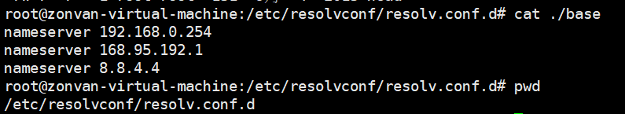

# web scenario

## 使用web scenario
1. DNS server 

2. 相关table

```
select * from httpstep;
select * from httpstepitem;
select * from httptest ;
SELECT * FROM httptestitem;

------------------
select * from httptest where name in ( '001後台', '002後台' ,'009後台');
select * from httpstepitem where httpstepid in (select httpstepid from httpstep where name in ('120後台','121後台') );
select * from httptest where httptestid in (select httptestid from httptest where name in ('120後台','121後台') );


update httpstep set timeout = '30' where 1=1;
update httptest set delay = '300' , retries = '5' where 1=1;
COMMIT ;


```


